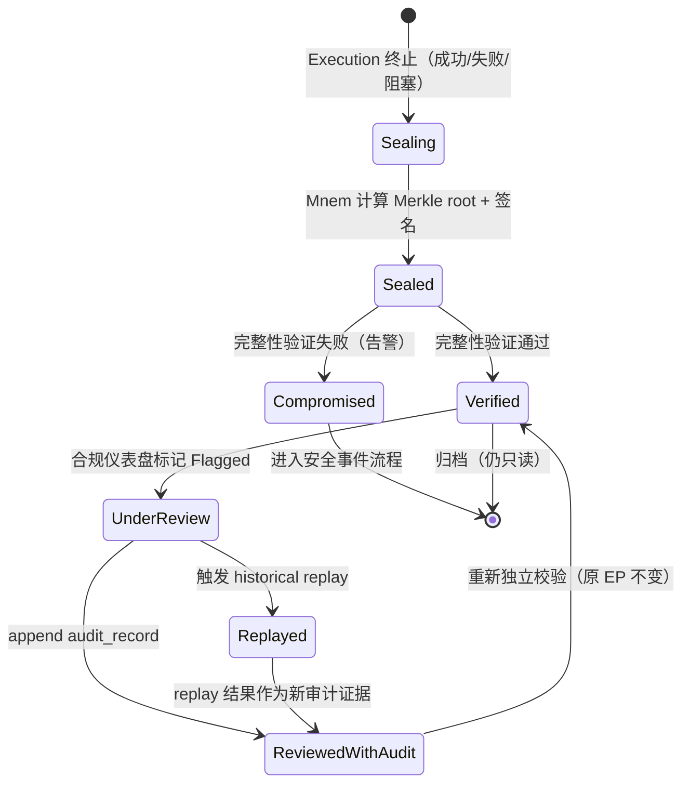
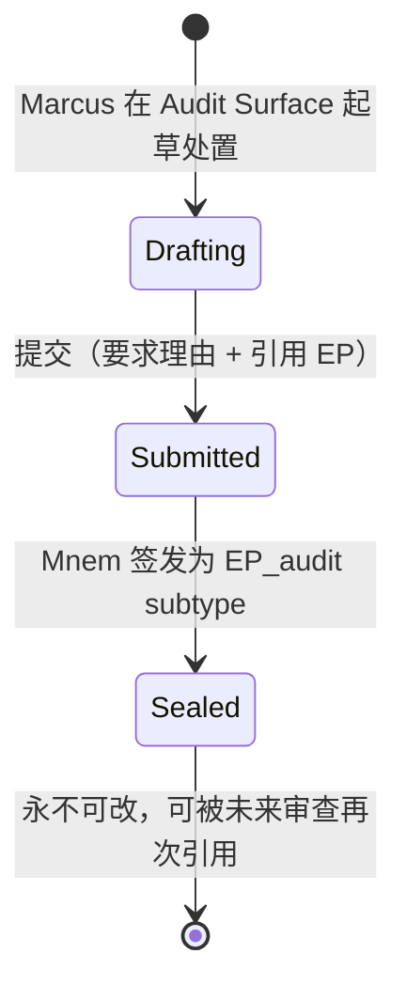

# 编排式取证 · 场景反推系统文档

> 基于 `ABC-Prime 12 个核心用户体验场景 v3.0.md` 第四部分编号 ⑤、第六部分场景 ⑤（行 720–870），以及第二部分 Prime 对象词典、第三部分红线 1 / 5 / 6 的约束反推。

---

## 1. 执行摘要

- **背景**：场景 ⑤「编排式取证」是 ABC-Prime 进入金融机构销售的"门票场景"——它把 AI 输出从"不可证"升级到"交易系统级可证"。它跨越 Mnem / Nomos / Hermes / Gateway 四个 Prime 子系统，但目前缺少一份将四者绑死在一起的工程契约文档，导致工程、合规、审计三方各说各话。
- **核心判断**：该场景的真正交付物**不是 UI**，而是**一组治理契约 + 一个不可变性的工程证明 + 一个独立验证工具**。UI 只是这些契约的可视化外壳。如果契约不齐，UI 再好看也撑不起合规问询。
- **最重要的下一步**：先交付 P0 的三份契约——**Evidence Pack Schema 规约**、**政策版本快照绑定规约 (Nomos × Mnem)**、**独立完整性验证工具规格**。这三份齐了，金融机构试点可以谈。

---

## 2. 输入理解

| 维度 | 内容 |
| --- | --- |
| 原始需求 / 场景 | 合规官 Marcus 接到客户 X 持仓超限问询，需在 60 秒内证明执行时刻合规 |
| 主要用户 | Marcus（合规官，主调用方）+ Lin（顾问，被审查方）+ 监管机构（最终读者） |
| 业务目标 | 把 AI 输出的"过程"沉淀为可被独立验证的执行图，应对 FINRA / SEC / 内审问询 |
| 当前痛点 | 普通 AI 工具只留对话日志；传统投顾只有人工注释；都无法回答"当时适用哪个 IPS 版本、每节点输入输出是否被篡改" |
| 约束条件 | 红线 6（新规则不改旧证据）、红线 1（蓝图冻结）、红线 5（不允许 runtime fallback）、60 秒 SLA、Evidence Pack 不可变只能 append |
| 预期产出 | 一份可读取、可验证、可重放、可追加审计的执行图谱 + 配套独立工具 |
| 显式提到的对象 | Mnem Trace / Evidence Pack / Nomos Versioned Policy / Hermes Historical Replay / Audit Surface / Capability Registry / Merkle root |

---

## 3. 核心场景

| 场景 | 角色 | 行为 | 目标 | 系统状态变化 | 产出物 |
| --- | --- | --- | --- | --- | --- |
| 5.1 调取与重建执行图 | Marcus | 从合规仪表盘点入被标记的 Execution | 60 秒内拿到完整 DAG | Evidence Pack `viewed` 事件追加（不改原 EP） | 可视化执行图 |
| 5.2 节点级证据钻取 | Marcus | 钻取「Pre-trade compliance」节点 | 看到当时绑定的 IPS 版本与 hash | 只读访问 Mnem Trace | 节点证据卡片 |
| 5.3 完整性独立验证 | Marcus / 外部审计师 | 运行 Verify Integrity | 证明 EP 未被篡改 | 生成 `verification_result`（独立记录） | 完整性证书 |
| 5.4 审查处置（追加而非覆盖） | Marcus | 标记"已通过（政策过渡期良性差异）" | 让审查结论可被未来追溯 | 创建新 `audit_record` 引用原 EP | 新审计 Evidence Pack（audit subtype） |
| 5.5 确定性历史 Replay | Marcus | 触发 Hermes historical replay | 在原上下文/数据 hash/模型版本下复算 | 产生 `replay_result`，hash 必须一致 | Replay 报告 |

> 5.1–5.3 是**只读取证主链**；5.4 是**写入但 append-only 的处置链**；5.5 是**最高强度证明**。三条链共用同一个不可变事件流，但权限边界完全不同。

---

## 4. 行为链

```text
Compliance Inbox (Flagged Execution)
   ↓
Marcus 打开 Audit Surface（只读）
   ↓
Mnem 重建执行 DAG（基于事件流 + Merkle root）
   ↓
绑定执行时刻的 Nomos Versioned Policy Snapshot
   ↓
节点级证据钻取（Capability + 输入/输出 hash + EP 边界）
   ↓
独立完整性验证工具 verify(EP) → ✓
   ↓
Marcus 决策：通过 / 升级 / Replay
   ├─ 通过 → append audit_record（新 EP，不改原 EP）
   ├─ 升级 → 触发 Replay
   └─ Replay → Hermes historical replay → output hash 比对
   ↓
通知 Lin（被审查方）+ 合规归档
   ↓
新审计事件进入 Mnem Trace（成为下一次审查的取证对象）
```

---

## 5. 用户价值与成功标准

| 用户价值 | 成功标准（可验收） | 可验证证据 |
| --- | --- | --- |
| 合规问询从"天"变"分钟" | Marcus 60 秒内回答"为什么当时允许" | 仪表盘到证据视图 P95 ≤ 60s |
| AI 输出有交易系统级审计强度 | 任何 EP 可被独立工具验证完整性 | 离线 CLI 工具产出与 Mnem 签名一致的 hash |
| 历史与现行政策解耦 | TSLA 7.8% 在 v2.3 下 PASS，且不被 v2.4 追溯改写 | EP 中存在 `policy_snapshot_id = ips_v2.3` |
| 处置不破坏证据链 | 审查结论以新 EP 形式存在，原 EP 永不变更 | 原 EP 的 Merkle root 在审查前后一致 |
| 可向监管/外审交差 | Replay 输出 hash 与原执行一致 | Replay 报告的 `match=true` |
| 顾问敢用 AI 做严肃决策 | Lin 知道 Evidence Pack 兜底她的执行 | EP 链接随每条 chat 输出一同呈现 |

---

## 6. 领域模型

| 对象 | 定义 | 关系 | 真相来源 |
| --- | --- | --- | --- |
| **Execution** | 一次受 EB / EP 约束的固定执行实例 | 1:1 ← Evidence Pack；1:N ← Mnem Event | Hermes |
| **Mnem Event** | 不可篡改的执行事件原子（节点开始/结束/输入 hash/输出 hash/Gateway 决策） | N:1 → Execution | Mnem |
| **Mnem Trace** | 一个 Execution 的事件流序列 | 1:1 ↔ Execution | Mnem |
| **Evidence Pack (EP_audit)** | 面向合规与用户的证据包；含 Merkle root、签名、policy_snapshot_id | 1:1 ↔ Execution；N:1 → Policy Snapshot | Mnem 签发 |
| **Policy Version Snapshot** | Nomos 在执行时刻冻结的政策版本快照（含 IPS、合规规则、约束阈值） | 1:N ↔ Evidence Pack | Nomos |
| **Capability Reference** | EB 中每个节点引用的 Capability ID + 版本 | N:1 → Capability Registry | Capability Registry |
| **Audit Record** | Marcus 等审查角色的处置记录；本身是 audit-subtype Evidence Pack | N:1 → 原 Evidence Pack | Mnem（append） |
| **Replay Result** | Hermes historical replay 的输出与 hash 比对结果 | N:1 → 原 Evidence Pack | Hermes Replay 子系统 |
| **Verification Result** | 独立验证工具的完整性校验结果 | N:1 → 原 Evidence Pack | 独立验证工具（与主系统隔离） |
| **Audit Surface** | 合规角色专属只读视图（Observation Surface 的一种） | 读 → 全部上述对象 | 前端 + Audit API |

> **统一术语**：对外只用 `Evidence Pack`、`Plan Preview`、`Capability`；`EB / EP / ESD / Mnem Trace` 留在内部 Schema 与 API 文档（沿用第二部分的对外用词建议）。

---

## 7. 状态机 / 生命周期

### 7.1 Evidence Pack 生命周期



**不变量**：

- 任何状态迁移**只能向 Mnem 追加新事件**，原 EP 字节不可变。
- `Sealed → Compromised` 是唯一可能让历史 EP 失信的迁移；一旦发生，整个 Mnem 服务进入安全事件响应（不在场景 ⑤ 范畴）。

### 7.2 Audit Record 生命周期



---

## 8. 系统模块与架构含义

| 模块 | 职责 | 输入 | 输出 | 边界（不能做什么） |
| --- | --- | --- | --- | --- |
| **Mnem Core** | 不可变事件流持久化 + Merkle 签名 + EP 签发 | Hermes 执行事件、Gateway 决策事件 | Mnem Trace、Evidence Pack | 不解释业务、不评估合规、不能被在线编辑 |
| **Audit Surface** | 合规角色只读视图 | EP id / 时间范围 / 客户 id | 可视化执行图、节点钻取 | **不能触发原 Execution 重新跑**（红线）；不能改任何 EP |
| **Independent Verifier** | 独立于主系统的完整性验证工具（CLI + Library） | EP 文件 + 公钥 | Verification Result | 不依赖在线主库；不写入 |
| **Nomos Snapshotter** | 在 Execution 启动时冻结政策版本快照并写入 EP | 当前 Nomos 生效政策 | `policy_snapshot_id` | 不能 retroactively 替换 snapshot |
| **Hermes Historical Replay** | 在原上下文/数据 hash/模型版本下复算 | 原 EP + Replay 请求 | Replay Result（含输出 hash） | 不影响生产数据；输出与原必须 hash 一致 |
| **Audit Record Writer** | 把审查处置写为 audit-subtype EP | 处置表单 + 引用 EP id | 新 EP_audit | 不能修改被引用 EP |
| **Compliance Dashboard** | 异常发现 + 钻取入口 | 风险标记规则 | Flagged Execution 列表 | 不携带任何写权限到原 EP |
| **Notification Bridge** | 通知被审查方（Lin） | Audit Record | 站内 / 邮件通知 | 不暴露处置敏感细节给非授权角色 |

**架构含义**：

- Mnem 必须是**写入路径上的硬关键路径**——所有节点产出在落库之前先落 Mnem。任何"先返回结果再补 trace"的优化都违反红线 6。
- Audit Surface 与 Compliance Dashboard 必须是**Observation Surface**（只读 Surface），与 Interaction Surface 共享前端框架但走不同的 API 后端，权限隔离在网关层而不是 UI 层。
- Independent Verifier **不能与主库共享部署**——这是该场景对外销售的核心 demo 价值。

---

## 9. 原则与真相来源

### 9.1 产品 / UX 原则

- **观察 ≠ 操作**：合规官在 Audit Surface 永远只能"看"和"追加新证据"，不能"再跑一次原执行"。
- **60 秒 SLA 是产品承诺**：从 Flagged 到节点级证据可视化必须在 60 秒内完成，超出即降级（先给摘要，再补全）但必须显式标注。
- **节点必须用业务语言命名**：合规官读到的是「Pre-trade compliance check」而不是 `capability.compliance.pre_trade.v3.2`——内部 ID 在折叠详情里。
- **每条 AI 输出都要带 Evidence Pack 入口**：Lin 的 chat 输出旁永远有 EP 链接，避免事后"找不到"。

### 9.2 AI 行为原则

- AI 在场景 ⑤ 中**完全不参与决策**——没有"AI 帮 Marcus 判断是否合规"。Replay 是确定性算法重放，不调用新一轮 LLM 推理。
- AI 总结（如"该执行在 v2.3 下合规"）必须**显式引用** policy_snapshot_id，不允许仅给自然语言结论。

### 9.3 数据 / 治理原则

- **政策版本绑定不可解除**：每个 EP 写入时必须冻结 policy_snapshot_id，不允许 NULL。
- **append-only 是物理性质**，不是约定：Mnem 存储层（WAL + 对象存储 + 签名）使后写不能回改前事件。
- **审查记录本身也是证据**：audit_record 是 EP 的一种 subtype，遵循相同不可变性。
- **跨监管口径独立化**：同一份 EP 必须能被 FINRA、SEC、内审用各自的 lens 解读，但底层字节相同。

### 9.4 真相来源

| 真相来源 | 用途 | 维护者 |
| --- | --- | --- |
| 场景 ⑤ 系统宪法 | 定义红线、不变量、状态机 | 院长 + 合规委员会 |
| Evidence Pack Schema 规约 | EP 字段/签名/Merkle 的工程契约 | 平台架构 + 合规 |
| Nomos × Mnem 政策快照绑定规约 | 红线 6 的工程实现 | Nomos 团队 + Mnem 团队 |
| 独立完整性验证工具规格 | 对外可分发的独立 verify 工具 | 安全团队 |
| Historical Replay 规格 | Hermes 重放的确定性边界 | Hermes 团队 |
| Audit Surface UX 规约 | 合规官每日入口 | 设计 + 合规 |
| 测试与验收脚本（5 条） | 验收 SLA、完整性、快照、append-only、replay | QA + 合规 |
| 跨监管口径映射 | 监管问询的标准答辩 | 合规 + 法务 |

---

## 10. 下一步产出物（场景 ⑤ 核心文档清单）

> **这是本次反推的主交付物**。下表是场景 ⑤ 进入 Banking-grade MVP 评审前必须齐全的所有文档，按优先级排序、分四层（治理 / 工程契约 / UX / 治理与审计）。每一份都给出"为什么必要"——把它绑回上面某一条原则、某一条红线或某一个验收标准。

### 10.1 P0 · 进入金融机构试点的最小集（必须齐）

| # | 产出物 | 类型 | 目的 / 绑定 | 主要使用者 | 依赖 |
| --- | --- | --- | --- | --- | --- |
| D1 | **场景 ⑤ 系统宪法** | Markdown | 把红线 1/5/6、5 条绝对红线、5 条验收标准统一表达；后续所有文档都引用它 | 全员 | — |
| D2 | **Evidence Pack Schema 规约 (v1)** | Markdown + JSON Schema | 字段、Merkle 结构、签名算法、`policy_snapshot_id` 绑定、append-only 规则 | 平台架构 / 合规 / QA | D1 |
| D3 | **Nomos × Mnem 政策版本快照绑定规约** | Markdown + 时序图 | 工程化实现红线 6——执行启动即冻结 snapshot，绑定写入 EP | Nomos / Mnem 团队 | D1, D2 |
| D4 | **独立完整性验证工具规格 (CLI + Library)** | 规格 + 参考实现骨架 | 把 EP 离线验证能力作为对外销售物料；CIO / IT 安全可独立运行 | 安全团队 / 客户 IT | D2 |
| D5 | **Mnem 不可变事件流持久化规约** | Markdown | WAL + 对象存储 + 签名链；明确"在线不可改"的物理边界 | Mnem 团队 / SRE | D2 |
| D6 | **Audit Surface UX 规约 (合规仪表盘 + 钻取 + 验证 + 处置)** | Figma + 文案库 + 状态映射表 | Marcus 60 秒动线；显式区分只读/append；节点业务语言命名 | 设计 / 前端 / 合规 | D1, D2, D8 |
| D7 | **审查处置（Audit Record）规约** | Markdown + JSON Schema | 处置作为 EP_audit subtype，引用原 EP，永不修改原 EP | Mnem 团队 / 合规 | D2 |
| D8 | **角色与权限矩阵 (合规官 / 顾问 / 管理员 / 法务 / 外部审计师)** | 表格 | 锁死"观察 ≠ 操作"原则在权限层 | 平台 / 合规 / 安全 | D1 |

### 10.2 P0–P1 · Banking-grade MVP 评审"卡脖子"补强

| # | 产出物 | 类型 | 目的 / 绑定 | 主要使用者 | 依赖 |
| --- | --- | --- | --- | --- | --- |
| D9 | **Hermes Historical Replay 规格** | Markdown | 确定性、原数据 hash 锁定、模型版本回滚、与生产隔离 | Hermes 团队 / 合规 | D2, D5 |
| D10 | **测试与验收脚本（5 条）** | Markdown + 自动化用例 | 60s SLA、完整性、政策快照、append-only、replay 一致——直接对应场景 ⑤ 的 5 条验收 | QA / 合规 | D1–D9 |
| D11 | **威胁模型 & 攻击面文档** | Markdown | 主系统被攻陷时独立 Verifier 仍可证伪——这是销售故事的关键 | 安全团队 / CISO 评审 | D4, D5 |
| D12 | **跨监管口径映射 (FINRA / SEC / 内审)** | 表格 + 案例 | 把 EP 字段映射到三类监管问询模板 | 合规 / 法务 / 销售 | D2 |
| D13 | **数据保留与不可变性策略** | Markdown | EP 保留年限、密钥轮换、签名链跨密钥延续 | 合规 / 安全 / 法务 | D2, D5 |

### 10.3 P1 · 团队扩散阶段补齐

| # | 产出物 | 类型 | 目的 | 主要使用者 |
| --- | --- | --- | --- | --- |
| D14 | **顾问侧 EP 入口 UX 规约**（在 Lin 的 chat 输出旁） | Figma | 让 Lin 也能从自己的输出找到 EP，自证清白 | 设计 / 前端 |
| D15 | **通知规约（被审查方 / 升级路径）** | Markdown | 处置后的通知边界与隐私控制 | 合规 / 平台 |
| D16 | **架构演进地图（Mnem ↔ Nomos ↔ Hermes ↔ Audit Surface）** | Mermaid + Markdown | 记录"为什么要把签名放 Mnem 而不是 Hermes"等关键决策 | 架构组 |
| D17 | **关键文案库（中英 / 监管/客户/内部三层）** | Markdown | 统一对外用词（Evidence Pack / Plan Preview / Capability） | 设计 / 销售 / 合规 |
| D18 | **场景 ⑤ 销售一句话与 Demo 脚本** | Markdown | 30/120/600 秒三档演示 | 销售 / 售前 |

### 10.4 P2 · 平台化阶段（与场景 ⑦ ⑩ ⑫ 联动）

| # | 产出物 | 类型 | 目的 |
| --- | --- | --- | --- |
| D19 | **跨执行批量取证 API 规格** | Markdown | 接合场景 ⑦ 跨顾问监督 |
| D20 | **政策迁移期"良性差异"识别规则集** | Nomos rule pack | 把"v2.3 下合规、v2.4 不合规"自动归类，减少 Marcus 工作量 |
| D21 | **审计集成接口（SIEM / GRC 平台）** | OpenAPI | 与 AuditBoard / Archer 等机构既有 GRC 平台对接 |

### 10.5 责任分工（RACI 摘要）

| 产出物 | R（负责） | A（问责） | C（咨询） | I（知会） |
| --- | --- | --- | --- | --- |
| D1 系统宪法 | 院长 | 合规委员会 | 平台架构 / 法务 | 全员 |
| D2 EP Schema | 平台架构 | CTO | 合规 / Mnem 团队 | QA / 安全 |
| D3 Nomos × Mnem 绑定 | Nomos Lead | CTO | Mnem Lead | 合规 |
| D4 独立验证工具 | 安全团队 | CISO | 平台架构 | 销售 / 客户 IT |
| D6 Audit Surface UX | 设计 Lead | 产品 | 合规 / 前端 | 销售 |
| D9 Replay 规格 | Hermes Lead | CTO | 合规 / 安全 | QA |
| D10 验收脚本 | QA Lead | 产品 | 合规 / 平台 | 全员 |

---

## 11. 风险、未知与问题

| 类型 | 内容 | 需要谁回答 |
| --- | --- | --- |
| 风险 | 60 秒 SLA 在执行图巨大（>200 节点）时是否仍可保证？需要分级降级策略 | 平台架构 + 合规 |
| 风险 | Mnem 签名密钥轮换时，旧 EP 的"独立验证"如何延续？ | 安全团队 |
| 风险 | Historical Replay 依赖原模型版本——若供应商下线该模型版本，replay 是否还能对齐 hash？ | Hermes 团队 + 法务 |
| 未知 | "良性差异"（v2.3 PASS、v2.4 FAIL）的标准化判定规则是否归 Nomos 还是 Audit Surface？ | 合规 + Nomos 团队 |
| 未知 | 审计 Record 是否需要与原 EP 同密钥签发，还是用审查角色独立密钥？ | 安全 + 合规 |
| 未知 | 外部审计师能否在客户场所使用独立验证工具，而无需访问 Mnem 在线服务？ | 安全 + 法务 |
| 问题 | 客户 IT 想要"导出全套 EP 到自己 S3"——边界与脱敏策略？ | 合规 + 法务 + 数据治理 |
| 问题 | 红线 5（不允许 runtime fallback）与场景 ③ 的"新契约新执行"如何在 EP 中显式表达成"链式 EP"？ | 平台架构 + 合规（场景 ③ 联动） |
| 问题 | Marcus 的处置是否需要双人复核（四眼原则）以进入 Sealed？ | 合规委员会 |

---

## 12. 建议行动

1. **本周内**：召集"院长 + 合规 + 平台架构 + Mnem Lead + Nomos Lead"五方 1.5h 工作坊，对齐并交付 **D1 系统宪法 v0.1**——这是后续所有文档的语义锚点。
2. **两周内**：并行起草 **D2 EP Schema** 与 **D3 Nomos × Mnem 绑定规约**；这两份不齐，红线 6 永远只是 PPT 上的承诺。
3. **四周内**：完成 **D4 独立验证工具规格 + 参考实现骨架**——这是 Banking-grade MVP 销售路演的"会场可演 demo"，价值远高于一份 UI mock。
4. **六周内**：基于 D1–D5 + D7 + D8，输出 **D6 Audit Surface UX 规约**与 **D10 验收脚本**；UX 与验收同时出，避免"做了 UI 才发现验收口径不对"。
5. **八周内**：交付 **D9 Replay 规格** + **D11 威胁模型** + **D12 跨监管口径映射**——这三份齐了，可正式邀约金融机构合规委员会评审。
6. **持续**：把场景 ⑤ 的 D1–D13 沉淀为"取证场景 Codex"，作为场景 ⑦（跨顾问监督）和场景 ⑩（Nomos 治理规则发布）的引用基底，避免后续场景重复造文档。

---

> **一句话总结（接续场景 ⑤ 自身的总结）**：
> 场景 ⑤ 的真正交付物，是把"Evidence Pack 不可变 + 政策版本快照绑定 + 独立可验证 + append-only 处置 + 确定性 replay" 这五件事从"红线宣言"升级为"工程契约 + 独立工具"。**先有契约和工具，UI 才能可信地存在。**
