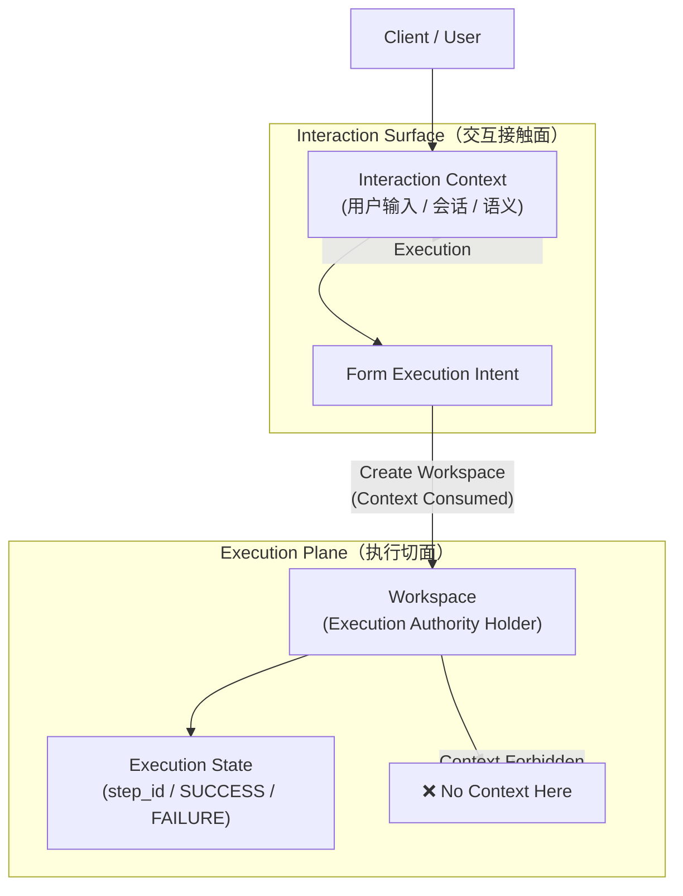

# Q&A｜核心概念与架构宪法 v1.2（讨论与沉淀）

---

# **Q&A｜核心概念与架构宪法 v1.2（讨论与沉淀）**

<aside>
💡

这是一个“先找、再问、再补充”的讨论页，不是裁决页，也不是实现说明页。

**提问心法**

> 不要问「X 在哪里」
**要问「X 在什么时候开始生效、在什么边界内存在、又在什么时候被强制终止」。**
> 

这是整套架构宪法的**灵魂提问方式**。

[**Q&A - 如何问问题？（Proposal）**](Q&A%20-%20%E5%A6%82%E4%BD%95%E9%97%AE%E9%97%AE%E9%A2%98%EF%BC%9F%EF%BC%88Proposal%EF%BC%89%202dbbc670d3638035a3f7ca3e6930428a.md)

</aside>

> 本页面用于**承接大家在研读《核心概念与架构宪法 v1.2》过程中产生的问题**
是一个**查找已有解释 → 提问 → 讨论 → 沉淀共识的工作页。**
> 

### **页面使用方式说明**

1. **先看宪法原文**
    
    本页面不是宪法正文，也不替代架构裁决。
    
2. **看这里是否已有类似问题与回答**
    
    已整理的问题，主要用于：
    
    - 解释设计动机
    - 澄清常见误解
    - 辅助理解各切面的边界
3. **如果没有找到答案，可以提问**
    - 请将宪法文档导出为 **PDF**
    - 导入 GPT 后进行提问
    - 将你的 **问题 + GPT 的回答** 整理后，补充到本页面对应分类中
4. **本页面不是最终裁决**
    - 这里的回答用于**讨论、理解与对齐**
    - 最终判断仍以《核心概念与架构宪法 v1.2》正文为准
    - 如发现回答与宪法冲突，应以宪法为准并修正本页内容

### **本页目标**

- 减少重复讨论
- 帮助新同学快速理解设计“为什么这样做”
- 沉淀典型问题，避免在 Execution / Orchestration / Control 边界上反复踩坑

---

# **一、关于四大切面与交互接触面（总体结构）**

## **Q1：为什么要分成 Control / Decision / Orchestration / Execution 四大切面？**

**A：**

因为系统中存在 **四种本质不同的问题类型**，如果不强制分离，就会自然演化成 Agent Runtime：

- **Control**：能不能做（合法性、合规性）
- **Decision**：这次用什么结构（一次性选择）
- **Orchestration**：现在到哪一步、下一步是什么（流程推进）
- **Execution**：把指定动作真实执行

架构宪法的目标不是“更聪明”，而是**防止权力与时间混用**。

---

## **Q2：为什么 Interaction Surface 不算一个 Plane？**

**A：**

因为 **Interaction Surface 不拥有任何权力**：

- 不决策
- 不编排
- 不执行
- 不判断

它只负责 **在执行发生之前，收集与规范化意图**。

一旦 Workspace 被创建，Interaction Surface 在架构意义上即终止职责。

---

## **Q3：为什么强调“一旦 Execution 出现，Surface 必须消失”？**

**A：**

因为如果交互逻辑继续参与执行期：

- 就会引入上下文判断
- 就会自然出现 retry / fallback / 智能决策
- Execution Plane 就会开始“长脑子”

这是 Agent Runtime 产生的经典路径。

---

# **二、关于 Control Plane（治理 / Guard Rail）**

## **Q1：Guard Rail（安全、合规、配额）为什么一定在 Control Plane？**

**A：**

因为 Guard Rail 定义的是 **“是否允许发生”**，而不是 **“如何发生”**。

只要一个规则：

- 是事前定义的
- 是运行期必须被强制的
- 能在 Gateway 被拦截

它就只能属于 **Control Plane**。

---

## **Q2：为什么 Control Plane 不直接参与执行？**

**A：**

因为一旦治理逻辑进入执行路径，就会变成：

- 执行时“自觉遵守”
- 或根据上下文“灵活处理”

这在宪法中是 **违法的**。

Control 只能裁决，**强制发生在 Gateway**。

---

## **Q3：PDP 和 Gateway 的关系是什么？**

**A：**

- **PDP（Policy Decision Point）**：
    
    负责“算规则”，只做裁决，不执行
    
- **Gateway（PEP）**：
    
    负责“强制规则”，是唯一执法点
    

系统中 **不存在 REP**（资源级执法点）。

---

# **三、关于 Decision Plane（一次性决策）**

## **Q1：为什么决策必须只发生一次？**

**A：**

因为一旦决策根据执行结果反复发生：

- 系统就形成反馈回路
- 结构会在运行期不断变化
- 系统会自然演化成 Agent

因此：

**Decision 只能在 Execution 之前发生一次，并被冻结。**

---

## **Q2：Workspace 为什么还能“触发 Decision”？**

**A：**

这里的含义是 **“Execution 尚未开始前，触发一次决策阶段”**，

而不是在执行中请求结构。

Execution 一旦开始：

- 不允许再调用 Decision
- 不允许修改 Assembly 或 VCS

---

## **Q3：什么是 VCS（Virtual Capability Surface）？**

**A：**

VCS 是 **本次任务被批准可用的能力集合**：

- 由 Decision Plane 生成
- 在 Execution 期冻结
- Execution Plane 只能在 VCS 范围内执行

---

# **四、关于 State Orchestration Plane（编排与判断）**

## **Q1：retry / fallback / 判断 应该放在哪里？**

**A：**

**只能放在 State Orchestration Plane。**

因为它们本质上都是：

> 决定流程如何继续
> 

Execution Plane 只能执行一次动作，**没有资格决定“再不再来一次”。**

---

## **Q2：Orchestrator 判断的依据是什么？**

**A：**

只能基于 **结构化输入**：

- Assembly Definition
- Execution State
- Execution Event（SUCCESS / FAILURE / TIMEOUT 等）

**不得基于：**

- 业务数据
- 模型输出内容
- 上下文语义
- 推理或启发式判断

---

## **Q3：为什么 Orchestrator 不能看“结果内容”？**

**A：**

一旦 Orchestrator 开始理解结果好不好：

- 它就不再是状态机
- 而是 Planner
- 系统会在这里变成 Agent Runtime

---

# **五、关于 Execution Plane（执行切面）**

## **Q1：Execution Plane 为什么要“愚钝”？**

**A：**

因为 Execution Plane 是 **唯一拥有执行权的地方**。

如果执行者同时：

- 理解上下文
- 判断结果
- 决定下一步

那它就天然具备 Agent 的全部特征。

---

## **Q2：Workspace 的唯一合法身份是什么？**

**A：**

**执行权主体（Execution Authority Holder）**

Workspace：

- 可以执行
- 可以调用 Gateway
- 可以返回结果

但：

- 不判断
- 不 retry
- 不 fallback
- 不持有上下文

---

## **Q3：Connector 是什么？为什么放在 Execution Plane？**

**A：**

Connector 是 **执行绑定实体（Workspace-scoped）**：

- 负责“怎么连到执行单元”
- 不拥有执行权
- 不判断
- 不跨 Workspace 复用

它放在 Execution Plane，

但 **不是智能模块，只是一段管线**。

---

# **六、关于 Context（上下文）**

## **Q1：上下文应该由谁负责？**

**A：**

**只能由 Interaction Surface 负责。**

上下文只存在于：

- 用户交互
- 意图形成阶段
- Execution 之前

---

## **Q2：Execution Plane 为什么不能有上下文？**

**A：**

因为一旦执行期对象接触上下文：

- 就可以基于历史判断
- retry / fallback 就会自然出现
- Execution Plane 会长出“大脑”

这是宪法明确禁止的。

---

## **Q3：Execution State 和 Context 有什么区别？**

**A：**

- **Execution State**：
    
    结构化流程状态（step_id、计数、成功/失败）
    
- **Context**：
    
    语义、历史、理解
    

前者合法（属于 Orchestration），

后者在执行期 **一律非法**。

## Q4: Interaction Surface 需要管理 Context，但 Execution Plane 又明确禁止 Context。在架构上，我们是如何划分 Context 的合法范围与生命周期的？

**A：**

在当前架构中，**Context 被严格限定为「交互上下文（Interaction Context）」**，它只存在于 **Interaction Surface**，用于理解用户意图。

**一旦 Workspace 被创建，Context 在架构意义上即被消费并终结**；
Execution Plane 中只允许存在 **执行权（Workspace）** 与 **执行状态（Execution State）**，而不存在 Context。

👉 **这是一条明确的时间与边界切割，用于防止 Context 进入执行期并导致 Agent Runtime。**

[Context in Nutshell](Context%20in%20Nutshell%202dbbc670d363808a88c0e7408fde5447.md)

---

## **使用说明（固定）**

> 后续新增问题请遵循同一格式：
**问题 → GPT 回答 → 归档到对应分类**
> 

> 本页面作为架构宪法的**问答补充与判例库**
> 

---