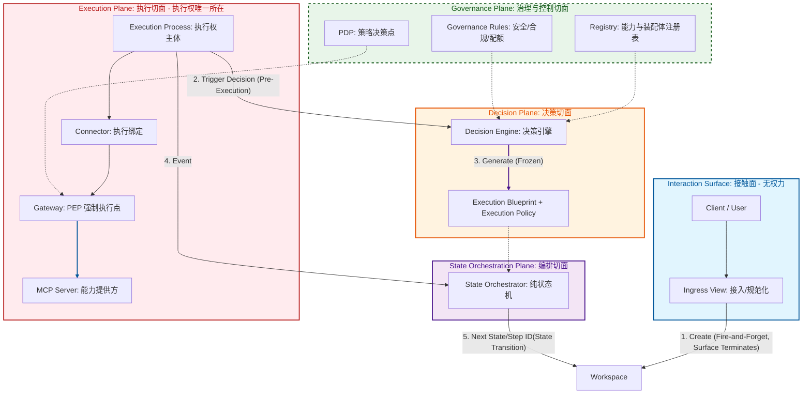
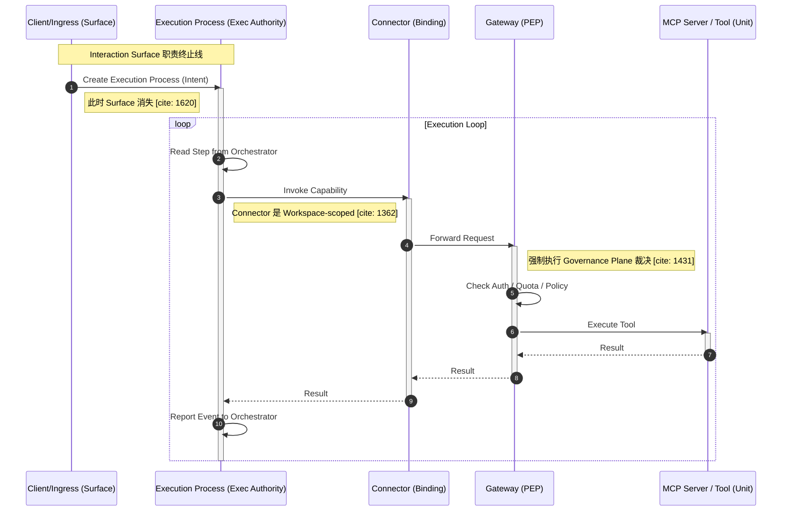

# 核心概念与架构宪法 v1.3.1

---

[返回🔙](https://www.notion.so/ABC-Core-2d9bc670d36380108184c6953a196c7c?pvs=21)

---

**这是 MCP Platform《核心概念与架构宪法 v1.3（优化版）》后续设计、代码、评审，一律以此为准。**

---

```
**修正历史：

核心概念与架构宪法 v1.3.1 Jan 30, 2026**
语义纠偏与对象定型：把前端的 Workspace 明确降级为 UI 名称；
后端与宪法坚持正确对象模型；前端改名作为第二阶段工作
****
**核心概念与架构宪法 v1.3 Jan 30, 2026**
把“Control Plane（大概念）”与“内部治理切面”彻底解耦，明确 Governance 是静态宪法，Decision 是 POM 编译器。
```

## 修正历史

### **✅ 修正前（存在歧义）**

- 页面/叙事层：**AI Control Plane**
- 四大切面之一：**Control Plane（治理与控制切面）**

👉 **同一术语，指代两个层级，必然引发长期混乱**

---

### **✅ 修正后（推荐，定型）**

### **1️⃣ 平台级概念（不变）**

- **ABC = AI Control Plane**（对外大概念）

### **2️⃣ 四大权力切面（对内实现）**

```
AI Control Plane（平台级概念）
└── Power Planes（四大权力切面）
    ├── Governance Plane        ← 原 Control Plane（必须改名）
    ├── Decision Plane
    ├── State Orchestration Plane
    └── Execution Plane
    
 从此以后：
	•	Control Plane = 世界观 / 品类 / 平台级概念
	•	Governance Plane = 内部“静态宪法切面”
```

---

# One Page Summary

[**MCP Platform｜核心概念一页纸（Architecture Constitution Summary）**](MCP%20Platform%EF%BD%9C%E6%A0%B8%E5%BF%83%E6%A6%82%E5%BF%B5%E4%B8%80%E9%A1%B5%E7%BA%B8%EF%BC%88Architecture%20Constitution%20Sum%202f8bc670d36380ba99bac135eba8031f.md)

---

# **定位与原则（必须先读）**

---

<aside>
💡

**本文档不是设计说明、不是最佳实践、不是实现建议。**

> **本文档是 MCP Platform 的“架构裁决依据（Architecture Constitution）”。**
当实现、讨论、PR、方案与本文档冲突时：
**以本文档为准。**
> 

任何**无法清晰映射到本文档中某一对象及其职责边界的实现**，均视为 **架构风险或违规**。

</aside>

---

## Governance-Centric

AI 时代的核心能力，不是生成智能，而是把智能约束在可治理的结构中。

能被治理的系统，才能产生复利；不能被治理的智能，只会放大不确定性。

| **❌ Intelligence-Centric（隐性失控）** | **✅ Governance-Centric（可复利）** |
| --- | --- |
| 强调“聪明”“自主”“能想”
决策与执行混杂
成功依赖个体英雄主义
出问题难以追责 | 决策权、执行权、验证权清晰分离
拆解产生短反馈
每一步都可审计、可回滚
AI 被限制在明确角色中 |
| 👉 在复杂系统中：**不可规模化、不可审计** | 👉 在复杂系统中：**稳定、可扩展、可演进** |

---

## **设计原则三问**

- 是否还有 **职责无处安放?**
- 是否还有 **权力未被锁死?**
- 是否还有 **未来必然出现、但现在没位置放的概念?**

---

## **文档目标**

在 **产品 / 架构 / 研发 / 平台 / 解决方案** 之间，统一 MCP Platform 的核心概念、权力边界与执行真相，明确：

- 每个对象 **是什么**
- 由谁创建、在什么时候创建
- 在什么层级生效
- **能做什么 / 绝对不能做什么（红线）**
- 在标准执行链路中的**唯一位置**

---

## **总体原则**

1. **一个词只允许一个含义**
2. **能运行的对象，必须有明确生命周期**
3. **能决策的对象，必须被严格限制在决策层**
4. **运行期不得修改已冻结的结构或权限**
5. **任何组件不得绕过 Governance Plane**
6. **只有 Execution Plane 中的执行权主体（Execution Process） 拥有现实世界的执行权**

---

## **术语声明（Terminology Constitution）**

**在本文档中：**

### **Plane（切面）**

指系统中不可跨越的制度结构切面，用于严格划分权力、时间与职责边界。
切面（Aspect / Slice）强调正交切割与强制隔离，而非层级调用。

### **Surface（接触面）(防腐)**

指人与系统或系统与外部的接触边界，不属于系统结构。
接触面是“薄的”，不承载决策、结构或执行权力。

### **Domain（领域）**

指语义或责任的讨论范围（如治理、安全、业务），不指代运行时结构。

### **Interface（界面）**

指 Surface 的具体实现形态，如 User Interface、API、CLI。

因此：

- **Governance / Decision / State Orchestration / Execution 均为 Plane（切面）**
- **Interaction 为 Surface（接触面）**
- **Governance / Security / Business 等为 Domain（领域）**

三者不可混用。

```
术语折中与前后端映射声明（冻结）

为降低用户体验与现有产品实现的迁移成本，**用户界面与对外 API 中暂时使用 “Workspace” 指代用户的长期工作空间。**

在系统语义与架构宪法中：
	•	Workspace（UI） ≡ Project Space（长期存在，不承载执行权）
	•	Session / Chat ≡ 编译上下文（不执行）
	•	Execution Process（或 Processing） ≡ 一次执行的运行实例

本文档中出现的 Execution Plane 中的 Workspace（UI) 概念，仅指 Execution Authority Holder，不等同于用户界面中的 Workspace。

前端术语不得影响后端对象的生命周期、权限与裁决语义。
```

---

# **一、整体架构观：权力切面 vs 接触面**

## **1.1 架构不是“层级调用”，而是“权力结构”**

系统由 **四个切面（Plane）** 与 **一个接触面（Surface）** 构成：

---

## **Power Planes（四大权力切面）**

用于定义：**谁在什么时候拥有“决定权”**

- **Governance Plane（治理切面）：**定义世界允许什么发生的**静态宪法；**不接纳意图、不生成计划、不参与执行。
- **Decision Plane（决策切面）**：这次任务使用什么结构
- **State Orchestration Plane（状态编排切面）**：状态推进 (State Machine??)
- **Execution Plane（执行切面）**：真实执行、改变世界

**术语澄清（冻结）**

- *AI Control Plane*：平台级概念（本系统整体）
- *Governance Plane*：内部权力切面之一
**二者不可混用。**

---

## **Interaction Surface （接触面 - 对外交互边界 - 无权力）**

**仅用于意图进入系统，不参与任何决策、编排或执行**

- **Client / Ingress View（接入、视图）**

---

### **🔴 架构红线**

> 任何将 Surface 职责提升为 Plane 权力的设计，均视为架构违规。
> 

```markdown
Power Planes（权力切面）
├── Governance Plane   ← 世界允许什么发生
├── Decision Plane   ← 这次任务使用什么结构 编译器
├── State Orchestration Plane   ← 当前执行到哪一步 Stateless
└── Execution Plane   ← 真正执行能力的地方 Stateless

===============================

Interaction Surface（无权力）
└── Ingress / Client View
```

| **词** | **专用对象** |
| --- | --- |
| **决策** | **Decision Engine** |
| **推进(编排）** | **State Orchestrator** |
| **调用** | **Execution Process → Gateway** |
| **执行** | **MCP Server** |





---

# **二、Governance Plane（治理切面 · 静态宪法）**

**本章性质说明**

**Governance Plane 定义世界允许什么发生，并确保任何执行都无法绕过。**

---

## **2.1 Governance 的本质定义（冻结）**

Governance Plane 是系统的静态宪法层。它定义并冻结：

- 世界中**哪些 Capability / Assembly 是合法存在的**
- 在什么组织 / 环境 / 合规条件下**允许被使用**
- 哪些边界**永远不可被 Decision 或 Execution 越过**

**Governance Plane：**

- 不接纳意图（Intention）
- 不生成 POM / Assembly
- 不参与执行
- 不随任务变化

**它只裁定一件事：“什么在制度上是合法的。”**

**关键词（必须同时满足）：**

- **事前**（Preemptive）
- **预定义**（Declarative）
- **强制**（Enforceable）
- **可追责**（Auditable）

---

### **裁决原则（必须理解）**

- 凡是 **“定义边界”** 的，必在 Governance Plane
- 凡是 **“决定一次具体行为”** 的，才有资格进入其他 Plane
- 凡是 **运行期才判断、靠自觉约束** 的，都不是治理

---

## **2.2 Governance Plane 的组成结构**

Governance Plane 由多个 **治理子域（Governance Domains）** 构成，它们共同作用于 Decision / Orchestration / Execution，但不被其调用。

```
Governance Plane
├── Security Governance
├── Cost / Quota Governance
├── Compliance Governance
├── Organization Governance
├── Capability Governance
└── Assembly Governance
```

> 上述子域**不是运行时模块，而是治理维度。**
它们的裁决统一通过 PDP 计算，并由 Gateway 强制执行。
> 

### **PDP（Policy Decision Point）**

- 属于 **Governance Plane**
- 只做裁决计算（Allow / Deny / Limit）
- 不执行、不调用、不参与流程

---

## **2.3 Capability Governance（能力治理）**

### **2.3.1 Capability Registry（能力注册表）**

**是什么**

> Governance Plane 中**唯一合法的 Capability 名册，**
用于定义“世界上有哪些能力存在”。
> 

**负责什么（允许）**

- Capability 的存在性、版本、状态
- Capability 与 MCP Server 的映射关系
- Capability的风险等级、合规标签、分类信息

**红线（禁止）**

- ❌ 运行期组件不得修改 Registry
- ❌ Decision / Orchestrator 不得私有定义 Capability
- ❌ Execution Process 不得感知 Registry 的全量视图

---

## **2.4 Assembly Governance（装配体治理）**

### **2.4.1 Assembly Registry（装配体注册表）**

**是什么**

> Governance Plane 中用于登记、审核、版本化、下线
**Assembly Definition 的唯一治理组件**
> 

**职责**

- 管理 Assembly 的生命周期（Draft / Approved / Deprecated / Disabled）
- 提供 Decision Engine 可选择的 Assembly 集合
- 为审计提供结构溯源

---

### **🔴 装配体裁决条款（必须遵守）**

```
- 系统中不存在“临时 Assembly”“运行期 Assembly”“本地 Assembly”
- 任何 Assembly Definition 若未进入 Assembly Registry，在架构上视为不存在
- Decision Engine 不得绕过 Registry 即兴生成 Assembly
- Assembly Orchestrator 只能执行 Registry 中的 Assembly
```

---

## **2.5 Organization Governance（组织治理）**

### **2.5.1 Tenant（租户）**

**是什么**

> Tenant 是 Governance Plane 中用于资源、策略、可见性隔离的最小治理单元。
> 

**职责**

- 隔离 Capability / Assembly 的可见性子集
- 绑定配额、成本与合规策略
- 定义审计与日志边界

**红线**

```
🔴 Tenant 不参与 Decision、Orchestration 或 Execution 行为
🔴 Tenant 只影响“能不能看到、能不能用”，不影响“怎么做”
```

---

### **2.5.2 Organization / Account（组织 / 账户）**

**是什么**

> Organization 是 Tenant 内部的组织结构表达，用于管理人员、应用与身份。
> 

**职责**

- 用户 / 应用 / Principal 的归属管理
- 角色与权限映射
- 审计可见性范围控制

**红线**

```
🔴 Organization 不定义 Capability 或 Assembly
🔴 Organization 不参与流程、顺序或执行判断
```

---

### **2.5.3 Environment（环境：prod / staging / sandbox）**

**是什么**

> Environment 是 Tenant 内的逻辑隔离环境，用于风险控制与发布治理。
> 

**职责**

- Capability 在不同环境的启停
- Assembly 在不同环境的可见性
- 配额、限流策略的环境差异化

**红线**

```
🔴 Environment ≠ Workspace
```

---

## **2.6 Security / Cost / Compliance Governance**

### **2.6.1 Security Governance**

- 鉴权规则
- Principal / Credential 管理
- 安全策略

### **2.6.2 Cost / Quota Governance**

- 调用配额
- 成本限制
- 预算控制

```
🔴 Quota 判断不得出现在 Orchestrator / Execution Process
```

### **2.6.3 Compliance Governance**

- 合规规则
- 风险拦截
- 审计要求

---

## **2.7 Policy Decision Point（PDP）**

**是什么**

> PDP 是 Governance Plane 内部用于**计算策略裁决结果**
> 

**特点**

- 只做裁决计算（Allow / Deny / Limit）
- 不执行、不调用、不参与流程
- 不理解业务语义

**调用时机**

```
PDP 的裁决仅在 Gateway 调用路径中发生
```

🔴 **PDP 冻结条款（新增）**

- PDP 的裁决只回答 *Allow / Deny / Limit*
- PDP 不理解 Intention
- PDP 不理解 Assembly
- PDP 不参与任何“这一次怎么做”的判断

👉 否则 PDP 将被误用为隐式 Decision Engine（严重违宪）

---

## **🔴** Governance **Plane 总红线**

```
- Governance Plane 不参与任何 Execution
- Governance Plane 不产生执行路径
- Governance Plane 的所有规则，必须可在 Gateway 处被强制执行
- 如果某规则无法在 Gateway 处执行，则该规则不是治理
```

---

### Governance **Plane 的一句话总结**

> **Governance Plane 定义世界允许什么发生；
Decision 决定一次任务怎么选；
Orchestration 决定当前到哪一步；
Execution 只负责让事情真的发生。**
> 

---

下一步，把**Control** **Plane定义为**“企业级平台标准形态”。

- 🧱 把 **Organization Governance** 单独抽成一页（供运营/平台看）
- 🔍 用这版 Control Plane 去 **反审现有实现是否有越权**

---

# **三、Decision Plane（决策与装配域）**

**Decision Plane 是系统中唯一的“编译器”。**

它在 **Control Plane (大概念）**定义的合法空间内：

- 接纳用户 Intention
- 编辑 POM（Execution Blueprint & Execution Policy）
- 实例化并冻结 **Execution Blueprint**

Decision 的权力不是“决定世界规则”，而是**在宪法之内，为一次任务生成合法的执行结构**

> Decision Plane ≡ Execution Compiler
它把 **Business Contract（意图）**
编译为
**Execution Blueprint（结构）+ Execution Policy（许可）**
并在执行开始前**冻结产物！**
> 

**编译器的输入 / 输出**

| **编译器世界** | **你们的系统** |
| --- | --- |
| Source Code | **Business Contract + Context** |
| Compiler | **Decision Plane** |
| IR / AST / CFG | **Execution Blueprint (EB)** |
| Target Constraints | **Execution Policy (EP)** |
| Executable | **冻结后的 EB + EP** |

### **编译器的关键特征，DP 全部满足**

### **✅ 编译只发生一次**

- 编译器：程序启动前
- Decision：Execution 开始前

> 执行期不允许重新编译（= 不允许执行期 Decision）
> 

---

### **✅ 编译产物是“结构事实”**

- 编译器输出：控制流图、指令布局
- Decision 输出：**EB（顺序 / 并发 / 合并）**

> EB 就是**CFG（Control Flow Graph）**
> 

---

### **✅ 目标平台约束是独立的**

- 编译器：目标架构 / 权限 / ABI
- 你们：**Execution Policy（合法能力集）**

> Policy ≠ Structure
> 

> 就像 **权限 ≠ 程序结构**
> 

---

### **✅ 运行时不能改结构**

- 编译后不能改程序指令
- Execution 后不能改 EB / EP

```
Decision Plane (Compiler)
  ├── Execution Blueprint (IR / CFG / POM)
  └── Execution Policy (Target Constraints / Capability Mask)
  
在编译器世界：
	•	指令 不能决定是否执行
	•	操作系统 + CPU 权限模型 决定能否执行

在你们系统：
	•	Orchestrator 不决定执行
	•	Workspace 不决定合法性
	•	Gateway + Policy 决定是否允许
	•	Capability 只是被动执行

👉 Execution Plane = Runtime + Syscall 层
**Decision 结束之后，系统里就不再存在“思考结构”的能力。
不是 Agent Runtime，而是一个“可编译、可冻结、可治理”的执行系统。**
```

## **3.1 Decision Engine（决策引擎）**

**是什么**

Decision Plane 在 Governance Plane 约束下，为任务生成 Execution Blueprint  **+** Execution Policy 的唯一组件。

**生命周期属性**

- 决策期对象
- **每个任务只运行一次**

**负责什么（允许）**

- 判断是否存在可复用 Assembly
- 选择 Capability，在任务开始阶段，基于 Governance Plane 约束，确定本次任务可使用的 Capability 集合（Execution Policy）
- 选择 / 实例化 / 受约束组合 Assembly
- 生成 Execution Policy (EP)

---

### **🔴 决策红线（必须遵守）**

- ❌ 不得在运行期重新生成或修改 Execution Blueprint (EB)
- ❌ 不得调用 Gateway / Capability
- ❌ 不得根据执行结果重新决策
    
    ➡️ **违反即视为 Agent 化风险**
    

🔴 能力选择红线：

- Capability 选择仅允许发生在 EB 生成阶段
- 运行期不得发生任何 Capability 替换或重新选择

```
而一旦承认：Decision Plane = Compiler

那么：
	•	不写 if
	•	不写 retry
	•	Orchestrator 纯状态机
	•	Policy 与结构分离

全部都变成了“必然结论”，而不是设计偏好。

如果你愿意，下一步我可以帮你把
**👉 整个系统画成一张“编译器 → 运行时”的对照图，**那会是你们这套宪法最“不可误解”的一页。
```

---

## **3.2 Execution Blueprint (EB)（能力装配体）**

**是什么**

定义能力之间**允许的结构关系与不变量**的结构模板。结构性声明模型 与 顺序 / 并发 / 合并。

**EB 是“结构事实”，不是“执行逻辑”。**

**生命周期属性**

- 设计期 / 决策期生成
- 进入 Execution 后 **不可变（冻结）**

**红线**

- ❌ 不执行
- ❌ 不运行期修改
- ❌ 不感知执行状态

```
**关于运行期条件判断（冻结）**
	•	系统不支持执行期路径条件（if / else）。
	•	任何会改变执行路径的条件，必须前置到 Decision Plane，并通过选择不同的 Execution Blueprint 实现。
	•	执行期仅允许合法性裁决（Allow / Deny / Limit），裁决失败只会终止执行，不会引发分支、重试或回退。
	•	如需基于新信息选择后续结构，必须结束当前执行，进入新一轮 Decision，生成新的 Execution Blueprint。
```

> **如果一个条件需要“等跑完一步才知道”，那它不该控制“接下来怎么跑”。

我们系不是缺少灵活性，**而是**把灵活性从“执行期即兴”升级为“决策期编译”**。
> 
> 
> **这正是它能长期稳定、可治理、不可 Agent 化的原因。**
> 

---

## **3.3 Execution Policy（EP）**

**是什么**

当前任务被批准可使用的 **Capability 集合（白名单）**。

- Policy 不诱导流程
- Policy 天然是“法律 / 边界 / 裁决”
- 与 Gateway / PDP 语义完美闭环

**Execution Policy ≈ Virtual Capability Contract（推荐同义说明）**

**它是一次任务在 Governance 宪法约束下，被批准可使用的 Capability 集合，相当于该任务的Capability POM**

**Execution Policy 不得被 Execution Plane 解释或推断，只能被 Gateway 强制执行。**

**重要澄清**

- EP **不包含 EB (Execution Blueprint)**
- EP **不包含顺序 / 流程**
- EP 只回答：**能不能用**

🔴 EP 冻结红线：

- EP 在 Execution Lifecycle 内不可修改
- 不允许任何组件维护 EP 的可变副本

```
Business Contract
   ↓ (Decision Plane 编译)
Execution Blueprint (EB)   ← How it is structured
Execution Policy (EP)      ← What is legally allowed
   ↓
State Orchestration
   ↓
Execution

**凡是“决定结构”的，进 Blueprint；
凡是“决定合法性”的，进 Policy；
凡是“需要运行期 if 的”，都不该存在。**
```

---

# **四、State Orchestration Plane（状态编排切面）**

**状态编排切面是纯状态机，不理解业务，不拥有执行权。Orchestrator 是纯状态机，而不是 Workflow Engine。**

## **4.1 State Orchestrator（能力状态编排）**

**是什么**

严格依据 Execution Blueprint 推进流程状态的 **纯状态机内核**。**只负责状态推进，不拥有执行权。**

**生命周期属性**

- 运行期对象
- 不持有业务数据

**负责什么（允许）**

- 根据 **Execution Blueprint + Execution State** 计算下一步
- 接收 **Execution Event** 更新状态

```
State Orchestration Plane 的所有判断，只能基于 Execution Blueprint、Execution State 与 Execution Event。

不得基于任何业务数据、执行结果内容、上下文语义或推理结论决定 retry、fallback 或状态迁移。
```

---

### **🔴 编排红线（必须遵守）**

- ❌ 不生成 Execution Blueprint
- ❌ 不选择 Capability
- ❌ 不调用 Gateway
- ❌ 不接收任何业务数据（CSV / JSON / Video）
- ❌ 不做重试 / fallback / 策略判断

---

## **4.2 Execution Event（执行事件）**

**是什么**

Execution Process → Orchestrator 的 **唯一合法状态输入**。

**只包含**

- step_id
- status（SUCCESS / FAILURE / TIMEOUT / VIOLATION）
- signal（结构化）

**红线**

- ❌ 不包含业务数据

---

## **4.3 Execution State（执行状态）**

**结构化、无业务数据**

**是什么**

由 Assembly State Orchestrator 维护的 **唯一权威流程状态**。

**红线**

- ❌ Execution Process 不得自行推断流程状态

🔴 状态唯一性原则：
Execution State 是流程状态的唯一真相来源，
任何组件不得维护第二份“当前流程状态”。

---

# **五、Execution Plane（执行切面）**

<aside>
💡

**本章性质说明（必须先读）
Execution Plane（执行切面）是系统中唯一拥有“执行权（Execution Authority）”的结构切面。**

它负责在所有决策、结构与状态都已确定之后，真实地调用能力、改变外部世界，并返回结果。

📌 **任何能“让事情真的发生”的对象，必须属于 Execution Plane。**

它不决策、不编排、不治理、不理解业务意图，
它只做一件事：**按照既定调用请求，真实地执行能力，并返回结果。**

</aside>

---

## **5.1 Execution Plane 的本质定义（冻结）**

**Execution Plane 回答的问题只有一个：**

> **“当所有决策与流程都已确定，
在这一刻，被批准的动作如何被真实执行？”**
> 

它**永远不回答**：

- ❌ 是否应该执行（Governance Plane）
- ❌ 用什么结构执行（Decision Plane）
- ❌ 现在轮到哪一步（State Orchestration Plane）

---

### **🔴 Execution Plane 的核心裁决原则**

```
- Execution Plane 不判断“是否该做”
- Execution Plane 不判断“下一步是什么”
- Execution Plane 不理解 Assembly / VCS
- Execution Plane 只执行“被要求执行的那一步”
```

---

## **5.2 Execution Plane 的组成**

Execution Plane 由 **真正执行能力的运行时实体**构成：

```
Execution Plane
└── Execution Process（唯一一等公民（执行权主体）执行进程 / 执行实例）      ← 执行权起点（Execution Authority Origin）
    ├── Execution Binding    ← 抽象概念（属于 Process）
    │    └── Connector       ← 实现形态（Process-scoped）
    ├── Gateway (PEP)
    └── Execution Units ← 真实执行能力
         ├── MCP Server
         ├── Tool
         └── LLM Gateway
```

> ⚠️ 注意
> 
> - **Execution Process（执行进程 / 执行实例）**：决定“这一次执行从哪里开始”
> - **Connector：执行绑定（Execution Process-scoped）**
> - **Gateway**：决定“法律是否被强制”
> - **Execution Units**：决定“动作是否被完成”

---

## **5.3 Execution Process（一等公民， 执行进程 / 执行实例）**

> Connector 不是执行权的一等公民。Execution Binding 的法律主体是 Execution Process。
Connector 只是 Execution Process 的运行期绑定实例（implementation detail），而不是独立的制度性对象。
> 

### **5.3.1 宪法级定义（冻结）**

> **Execution Process（执行进程 / 执行实例） 是一次可执行任务的执行起点，是系统中执行权（Execution Authority）的唯一合法起点。
Execution Process（执行进程 / 执行实例）** 更安全的称谓应始终是：👉「执行权主体（Execution Authority Holder）」
> 

只要某个对象：

- 发起请求
- 调用 Gateway
- 汇总执行结果

👉 **它就必须是 Execution Process（执行进程 / 执行实例），且必须属于 Execution Plane。**

---

### 5.3.2 Execution **Process 的 终止 / 取消 / Kill 语义**

Execution Process 的终止只能由：

- Governance 触发的强制裁决（Quota / Compliance）
- State Orchestrator 的自然终态
- 平台级运维控制（break-glass）

❌ Execution Process 的终止不得由 Session / User Prompt / Tool 触发。

这会让运维、SRE、合规在未来有清晰抓手。

---

### **5.3.3 Execution Process（执行进程 / 执行实例） 的红线（不可触碰）**

**🔴 执行权红线**

- ❌ 不选择 Capability
- ❌ 不生成或修改 Assembly
- ❌ 不决定流程逻辑（顺序来自 Orchestration）
- ❌ 不绕过 Gateway

📌 Execution Process（执行进程 / 执行实例） **有执行权，但没有决策权。**

---

## **5.4 Connector （执行绑定 · Execution Process-scoped）**

### **5.4.1 Connector 是什么**

> **Connector 是 Capability 在某个 Execution Process 中完成参数配置与授权后的唯一运行态绑定实例(Execution Process-scoped)。**用于将 **Execution Process** 中的一次执行请求，绑定到一个具体的 Execution Unit。
> 

**Connector 是：Execution Process 在“一次执行中”，为了调用某个具体 Execution Unit，所创建的“运行期绑定实例”。**

关键限定词（一个都不能少）：

- **Execution Plane 中，不拥有执行权**
- **执行绑定（不是执行本体）**
- **Execution Process-scoped**
- **运行期存在**

```
**Execution Process
   ↓（授权 / 指令）
Connector
   ↓（转发）
Gateway
   ↓（执行）
Execution Unit

三个“绝对不能反过来”的关系
	1.	❌ Connector 不能创建 Execution Process
	2.	❌ Connector 不能独立调用 Gateway
	3.	❌ Connector 不能决定“要不要执行”
	
Connector 永远是“被调用者”，不是“调用发起者”**

```

**生命周期关系**

**Execution Process 的生命周期**

```
Created
  ↓
Running
  ↓
Terminated
```

**Connector 的生命周期（严格从属）**

```
Execution Process created
  ↓
Connector created (for capability X)
  ↓
Connector used (0..n times)
  ↓
Execution Process terminated
  ↓
Connector destroyed
```

**Connector 的生命周期 ≤ Execution Process 的生命周期**

如果你看到：

- Connector 能跨 Execution Process 复用
- Connector 能被缓存、复活、复用

👉 **那就是严重违宪。**

👉 **FD 不能自己发起 syscall，只能被 Process 使用。**

| **Linux** | **你们** |
| --- | --- |
| Process | Execution Process |
| File Descriptor / Socket | Connector |
| syscall | Gateway |
| Kernel | Execution Plane |

👉 **Binding 不是执行主体。**

| **K8S** | **你们** |
| --- | --- |
| Pod / Job | Execution Process |
| ServiceAccount / Volume / Network binding | Connector |
| API Server | Gateway |
| Container | Execution Unit |

**Connector 与 Execution Process 的关系（冻结）**

Connector 是 Execution Process 在一次执行中，为调用某个具体 Execution Unit 而创建的运行期绑定实例。

- Connector 不拥有 Execution Authority
- Connector 不能独立发起执行
- Connector 的生命周期严格受限于其所属的 Execution Process
- Connector 只能在 Execution Process 的指令下，转发调用至 Gateway

任何试图让 Connector 脱离 Execution Process 独立存在、复用或决策的设计，均视为架构违规。

---

### **5.4.2 Connector 在 Execution Plane 的正确结构位置**

你现在这张结构图是**完全正确的**：

```
Execution Plane
├── Execution Process（执行进程 / 执行实例）        ← 执行权起点
├── Connector        ← 执行绑定（Workspace-scoped）
├── Gateway (PEP)    ← 策略强制执行
└── Execution Units
    ├── MCP Server
    ├── Tool
    └── LLM Gateway
    
 这张图隐含了一个非常重要的秩序：
	1.	Execution Process（执行进程 / 执行实例） 拥有执行权
	2.	Connector 负责“怎么连”
	3.	Gateway 负责“允不允许”
	4.	Execution Unit 负责“真的做”
```

---

### **5.4.3 Connector 的宪法级红线**

```
- ❌ 不拥有 Execution Authority
- ❌ 不选择 Capability
- ❌ 不独立调用 Gateway
- ❌ 不跨 Execution Process（执行进程 / 执行实例） 复用
- ❌ 不包含流程 / 条件判断
- ❌ 不缓存或推断执行状态

Connector 只能在 Execution Process（执行进程 / 执行实例） 的命令下存在和使用。

- ❌ 不跨 Execution Process（执行进程 / 执行实例） 共享
- ❌ 不参与能力选择
- ❌ 不承载 Tool 逻辑
- ❌ 不包含条件判断或执行顺序逻辑
```

---

## **5.5 Gateway（策略强制执行点 · PEP）**

### **5.4.1 宪法级定义（冻结）**

> **Gateway 是 Execution Plane 中唯一的 Policy Enforcement Point（PEP）。**
它负责将 Governance Plane 的裁决结果，在执行期进行不可绕过的强制执行。
> 
- 强制执行 Governance Plane 裁决
- 所有执行必须经由 Gateway

🔴 系统中 **不存在 REP**（Resource Enforcement Point）。

---

### **5.4.2 Gateway 的职责（允许）**

- 鉴权 / 身份校验
- 配额 / 限流 / 成本控制
- 合规与安全策略执行
- 审计与日志
- 将合法请求转发给 Execution Units

---

### **5.4.3 Gateway 的红线**

- ❌ 不生成策略
- ❌ 不修改裁决
- ❌ 不理解 Assembly / 流程
- ❌ 不做业务判断

📌 **Gateway 只执法，不思考。**

🚫 **系统中不存在 REP（Resource Enforcement Point）**

任何 Execution Unit 均不得进行合法性判断。

---

## **5.6 Execution Units（执行单元）**

### **5.5.1 MCP Server（能力提供方）**

**是什么**

**MCP Server 是按照 MCP 协议，承载并执行 Capability 的运行时服务。**

- 长生命周期
- 独立于 Workspace 存在
- 不感知 Workspace / Assembly / VCS
- 不判断合法性

它是 Execution Plane 中最核心的实体。

---

**生命周期属性**

- 长生命周期服务
- 独立于 Workspace 存在
- 不随任务创建 / 销毁

---

**负责什么（允许）**

- 接收来自 MCP Gateway 的调用请求
- 执行对应的 Tool / Capability
- 返回执行结果或错误

---

**🔴 MCP Server 红线（必须遵守）**

```
- ❌ 不感知 Execution Process（执行进程 / 执行实例）
- ❌ 不感知 Assembly / Definition
- ❌ 不感知 VCS
- ❌ 不判断调用是否合法
- ❌ 不理解业务意图
```

一句话：

> MCP Server 只知道“我要执行什么”，
不知道“为什么执行、谁在执行、接下来会发生什么”。
> 

---

### **5.5.2 Tool（能力实现）**

> Capability 在 MCP Server 内部的最小执行单元。
> 
- 纯执行逻辑
- 不调用其他 Tool
- 不访问 Workspace
- 不包含流程控制

### **是什么**

> **Tool 是 Capability 在 MCP Server 内部的最小执行单元。**
> 

---

### **关系澄清（非常重要）**

```
Capability ≠ Tool ≠ MCP Server
```

- Capability：平台层的能力抽象（治理对象）
- Tool：具体实现逻辑（代码）
- MCP Server：Tool 的运行承载体

---

### **🔴 Tool 红线**

```
- ❌ Tool 不得直接调用其他 Tool
- ❌ Tool 不得访问 Workspace
- ❌ Tool 不得包含流程控制逻辑
- ❌ Tool 不得判断合规 / 权限
```

👉 **Tool 是“纯函数式执行单元”（带副作用的那种），不是流程节点。**

---

### **5.5.3 LLM Gateway（模型执行入口）**

### **是什么**

> LLM Gateway 是大模型访问的统一执行入口，
在 Execution Plane 中扮演“模型执行器”的角色。
> 

---

### **生命周期属性**

- 长生命周期
- 可被多个 Workspace 共享

---

### **负责什么（允许）**

- 接收模型调用请求
- 路由至具体模型（OpenAI / 本地 / 私有模型）
- 返回模型输出

---

### **🔴 LLM Gateway 红线**

```
- ❌ 不参与 Decision
- ❌ 不参与 Orchestration
- ❌ 不生成或修改 Assembly
- ❌ 不感知流程状态
```

👉 **LLM Gateway ≠ Agent ≠ Planner**

---

### **5.5.3 LLM Gateway（模型执行入口）**

> 大模型调用的统一执行器。
> 
- 只负责模型调用
- 不参与 Decision / Orchestration
- 不生成或修改结构

---

## **5.7 Execution Plane 与其他切面的边界（裁决级）**

### **与 G**overnance **Plane**

- Governance Plane：裁决是否合法
- Execution Plane：不理解规则，只服从
- **所有执行必须经由 Gateway**

---

### **与 Decision Plane**

- Decision Plane：冻结结构与能力集合
- Execution Plane：只执行被请求的动作
- ❌ 禁止执行期重新决策

---

### **与 State Orchestration Plane**

- Orchestration：决定“现在轮到哪一步”
- Execution：执行“被指派的那一步”
- ❌ Execution Plane 不推进状态

---

## **5.8 执行切面总红线（汇总）**

- ❌ 执行期不得选择 Capability
- ❌ 执行期不得修改结构
- ❌ 执行期不得绕过 Gateway
- ❌ 执行期不得基于结果做条件分支
- ❌ Execution Unit 不得拥有合法性判断

---

## **5.10 执行切面的一句话宪法总结**

**Execution Plane 是系统中唯一“让事情真的发生”的地方，**

但它永远不知道：

- 为什么是这一步
- 谁决定了这一步
- 接下来还会发生什么

---

## **5.11 Execution Plane 与其他 Plane 的边界关系**

### **与 Orchestration Plane 的关系**

```
Orchestration Plane：决定“现在轮到哪一步”
Execution Plane：执行“被指派的那一步”
```

🔴 **Execution Plane 不得反向影响流程推进**

---

### **与 Decision Plane 的关系**

```
Decision Plane：决定“这次用什么结构”
Execution Plane：不关心结构，只执行请求
```

🔴 **Execution Plane 不得基于执行结果触发重新决策**

---

### **与 G**overnance **Plane 的关系**

```
Governance Plane：定义规则
Execution Plane：不理解规则
Gateway：在两者之间强制执行
```

🔴 **Execution Plane 不得绕过 Gateway**

---

## **5.12 Execution Plane 的唯一合法调用路径**

```
Workspace
  → Connector
      → Gateway（PEP）
          → MCP Server
              → Tool
```

**任何偏离上述路径的执行，均视为 架构违规。**

---

## 5.14 **Execution Plane 总红线（汇总）**

**🔴 Execution Plane 总红线（汇总）**

```
- Execution Plane 不参与任何决策或编排
- Execution Plane 不感知上下文、流程或结构
- Execution Plane 的执行必须经由 Gateway
- Execution Plane 不得主动触发任何下一步行为
```

---

**Execution Plane 的一句话总结**

> Execution Plane 是 MCP Platform 中唯一“把世界真的改变”的地方，
> 

> 但它永远不知道：
**是谁决定了这一步、
为什么轮到这一步、
以及接下来还会发生什么。**
> 

---

**最后一句（执行层定海神针）**

> **Execution Plane 越“愚钝”，整个系统就越安全、越可演进。**
> 

---

---

下一步可以：

- 🔍 **用这一章反审现有 MCP Server / Tool 实现是否越权**
- 🧱 **生成一页《Execution Plane 实现检查表》**
- 📘 **把 Execution Plane 拆成“给执行团队看的版本”**

这一章的目的是确保我**们的系统在“执行层面”不可能被写歪了。**

---

# **六、Interaction Surface（交互接触面 · 无权力）**

```
关于用户界面 Workspace 的定位（冻结）

用户界面中的 Workspace 属于 Interaction Surface 的组织形态，
用于承载用户的长期上下文、Session 与历史。

Interaction Surface 中的 Workspace：
	•	不属于 Execution Plane
	•	不拥有 Execution Authority
	•	不得直接或间接调用 Gateway

一旦 Execution 开始，Interaction Surface 的职责即告终止。
这一步可以彻底切断 UI Workspace → Execution Authority 的联想。

**对于用户：
Workspace (UI)
└── Chat
    └── Run
    
对于系统
Project Space
└── Session
    └── Execution Process (EB + EP)
    
Execution Authority 永远只在：
Execution Process ∈ Execution Plane**
```

## 6.1 定义

> **Interaction Surface 是系统与外部的意图接触边界。**
> 

它存在于 **Execution 发生之前**，在 **Workspace 创建后即终止职责**。
****

> **Interaction Surface** 前端的 Workspace 是“用户长期工作区（Project 语义）”
平台的 Execution Process 是“一次执行的内核级运行实体”。
二者名字相似，但在语义、生命周期与权力上完全不同。
> 

**前后端概念一一映射表（定稿级）**

| **层级** | **前端（UX / Product）** | **后端（System / Constitution）** | **本质差异** |
| --- | --- | --- | --- |
| 长期空间 | **Workspace (UI)** | **Project Space** | 组织 / 权限 / 资源 |
| 上下文 | **Chat** | **Session / Conversation** | 对话 / 编译上下文 |
| 一次运行 | **Run / Execute** | **Execution Process** | 内核级执行实体 |
| 执行约束 | 不可见 | **Execution Policy (EP)** | 法律 / 治理 |
| 执行结构 | 不可见 | **Execution Blueprint (EB)** | 冻结结构 |

👉 **关键点**

- UI 的 Workspace **永远不会**映射到 Execution Process
- Execution Process **永远不会**暴露给 UI

```
**前端生命周期（用户视角）**
Workspace (一直存在)
└── Chat (长期 / 可切换)
└── Run (瞬时触发)

**后端真实生命周期（系统视角）**
Project Space (长期存在)
└── Session (长期存在)
    └── Execution Process
         ├── created
         ├── run
         └── terminated (不可续命)

**凡是拥有 Execution Authority 的对象，在系统中只能是 Execution Process。**
```

| **对象** | **是否可“继续”** | **是否可复用** | **是否有执行权** |
| --- | --- | --- | --- |
| Workspace（UI） | ✅ | ✅ | ❌ |
| Session | ✅ | ✅ | ❌ |
| **Execution Process** | ❌ | ❌ | ✅ |

---

| **Workspace（UI）** | **Execution Process（后端）** |  |
| --- | --- | --- |
| **Workspace（UI）**
• 用户能进入
• 用户能待着
• 用户能反复使用
• 心智模型 = 房间 / 项目 | **Execution Process（后端）**
• 系统创建
• 一次运行
• 执行完即消失
• 心智模型 = 进程 / Job / PID |  |
|  |  |  |

👉 **这是工程世界里“空间”和“进程”的根本区分。**

### **Workspace 与 Execution Process 的概念对齐（冻结）**

用户界面中的 **Workspace（UI)** 是用户的长期工作区，在系统语义上等价于 **Project Space**，用于组织 **Session**、**上下文与历史记录。**

**Workspace（UI) 不属于 Execution Plane，不承载 Execution Authority，不得调用 Gateway。**

系统中唯一拥有 Execution Authority 的对象是 **Execution Process**。Execution Process 表示一次执行的内核级运行实例，生命周期严格等同于一次执行，创建后运行，完成后终止，不可复用、不可续命、不可交互。

**需要注意是：Interaction Surface 不属于系统结构的一部分，它不是 Plane，不拥有任何运行期对象或生命周期裁决权。**

- 防止有人把 Surface 当成“轻量 Plane”
- 防止有人在 Surface 里加 cache / 状态 / 逻辑

---

### **6.1.1 Interaction Surface 只做：**

- 接收请求
- 规范化意图
- 触发任务创建

### **6.1.2 Interaction Surface 永远不做：**

- ❌ 执行
- ❌ 决策
- ❌ 编排
- ❌ 持有执行权

🔴 **一旦 Execution 出现，Surface 必须消失。**

---

## **6.2 Interaction Surface 的总体裁决原则（冻结）**

```
- **Interaction Surface** 不做任何“决定”
- **Interaction Surface** 不改变执行路径
- **Interaction Surface** 不拥有业务判断权
- **Interaction Surface** 只能投递、呈现

三条必须同时成立的新原则（缺一不可）

① 时间原则（最重要）
**Interaction Surface 只存在于“执行之前”。**

一旦 Execution 开始，Interaction Surface 的职责已经结束。

⸻

② 权力原则
Interaction Surface 不承载、也不包裹任何执行权。

凡是拥有 Execution Authority 的对象，自动不可能属于 Surface。

⸻

③ 结构原则
**Interaction Surface 不包含 Project、Session、或 Connector。**

这是硬禁止条款。
```

🔴 **任何将 Interaction Surface 写成“半个大脑”的设计，均视为架构违规。**

---

## **6.3 唯一合法执行路径（冻结）**

> **Interaction Surface 是系统与外部世界之间的“意图接触边界”，
用于接收、规范化并投递“执行意图”。**
> 

```
Client / Ingress
  → Workspace(UI) [Project Space]
	  → Chat [Session]
      → Prompt Run [Execution Process]
                      → [Execution Unit]
```

📌 **Interaction Surface 的职责，在 Execution 开始前即告结束。**

**Interaction Surface 的职责终止于Workspace 被创建的那一刻。**从这一刻起：

- 执行权转移至 Execution Plane
- Interaction Surface 不再参与

任何偏离上述路径的行为，**均视为架构违规。**

---

## **6.4 Interaction Surface 总红线**

**Interaction Surface 负责“把意图送进系统”，但不负责“事情是怎么发生的”。**

- ❌ Interaction Surface 不承载 Execution
- ❌ Interaction Surface 不拥有执行权

---

## **6.9 一句话宪法总结（替换旧版）**

**🔚 最终宪法判词（冻结）**

> Plane 定义权力，
Surface 承载意图，
Workspace 行使执行权，
Gateway 强制法律。
**Execution Plane 越愚钝，整个系统越安全、越可演进。**
> 

**一旦 Execution 出现，Surface 必须消失。**现在做的这件事，本质上是在完成一句话：

**“我们不是在做一个 Agent Runtime，而是在做一个可治理执行平台。”**

**Interaction Surface 的重定义，是这两者之间的分界线。**

---

# **八、标准执行调用路径（冻结）**

---

```
长期空间（治理）Project Space
└── 会话（上下文）Session / Conversation
    └── 执行实体（一次运行）Execution Process
         └── 受策略约束 governed by Execution Policy
         
Project Space
└── Session / Conversation
    └── Execution Process
         └── governed by Execution Policy
         
本系统的执行模型与 Linux / Cloud / Enterprise 系统一致：
用户在 Project Space 中工作，
在 Session 中形成上下文，
每一次运行都会创建一个独立的 Execution Process，
并在 Execution Policy 的约束下完成并终止。

凡是成熟系统，都把“执行实体”叫 Process / Job，而不是 Workspace。

三、执行实体的三条“内核级定律”

定律 1：执行实体必须是“不可伪造的”

在成熟系统里：
	•	你不能随便 new 一个 Process
	•	你不能假装自己是 Job
	•	你不能绕过创建路径

对应到你们系统：

Execution Process 必须只能由系统创建，
不能由 Session / UI / Tool / MCP Server 伪造。

这是不是 Kernel 实现不重要，
但必须是“不可绕过的架构内核”。

⸻

定律 2：执行实体必须有“完整生命周期裁决权”

Process / Job 之所以是内核对象，是因为：
	•	谁创建
	•	什么时候运行
	•	什么时候结束
	•	能不能继续

都不是业务代码说了算。

对应你们系统：

Execution Process 的生命周期
不能由 Session 决定，
不能由 Tool 决定，
不能由用户输入决定。

只要生命周期能被应用层“续命”，
它就不是 Process 语义。

⸻

定律 3：执行实体是“执行权的最小载体”

在 OS 里：
	•	权限绑定在 Process 上
	•	资源绑定在 Process 上
	•	审计绑定在 Process 上

对应你们系统：

Execution Authority
必须 100% 收敛在 Execution Process 上。

谁能调用 Gateway？
谁能触发真实副作用？
谁对审计负责？

答案只能是 Execution Process。
```

| ABC | **Linux** | **Google** | **Microsoft** |
| --- | --- | --- | --- |
| Project Space | Working Dir | Namespace / Project | Tenant / Subscription |
| Session | Shell Session | Client Context | User Session |
| Execution Process | Process (PID) | Pod / Job | Process / Job |
| Execution Policy | SELinux / DAC | RBAC / Admission | ACL / Policy |

---

**我们的“Kernel 等价物”其实是这三个东西的组合：**

```
Execution Process  （执行实体）
+ Gateway (PEP)    （权限裁决）
+ State Orchestrator（执行状态内核）
```

| **OS Kernel 职责** | **你们的对应物** |
| --- | --- |
| Process table | Execution Process registry |
| Syscall gate | Gateway (PEP) |
| Scheduler | State Orchestrator |
| Permission check | Execution Policy |
| Kill / exit | Execution termination |

**我们的“平台内核”**。不是 Linux Kernel，但**是架构意义上的 Kernel**。**“凡是成熟系统，都把‘执行实体’叫 Process / Job”**

**这个名字本身在工程师脑中，已经绑定了‘内核级、一次性、不可交互、不可复用’的语义。**

> 在操作系统里，Process / Job 是 Kernel 对象；在我们平台里，Execution Process 是“架构内核对象”。
不要求写一个 OS Kernel，但要求：Execution Process 的地位，必须等价于 Kernel 里的 Process。
> 

> Execution Process 是否位于操作系统内核并不重要；重要的是，它在架构语义上是否承担了与 Process / Job 等价的“内核级执行实体”职责。
凡是不能被伪造、不能被续命、不能被绕过的执行实体，才有资格被称为 Execution Process。
> 

> Kernel 是一个“职责级别”，不是一个“代码位置”。
> 

---

> **一个系统是否可长期演进，不取决于它有多少智能，
而取决于：智能是否被关在它该在的位置。**
> 

---

下一步：

- 🔍 **把这版 v1.1 套进现有实现，逐条审是否违规**
- 🧱 **生成 PR / 设计评审 Checklist**
- 📘 **拆成《新成员 30 分钟理解 MCP 架构》的入门版**

---

# Review - 完备性验证

**能想到的职责，是否都已经被强制放进了某个明确的位置？**

[Review Ideas](Review%20Ideas%202d8bc670d363809c8e6ce477d36da950.md)

[**如果使用 Agent，会在哪 10 个地方失控**](%E5%A6%82%E6%9E%9C%E4%BD%BF%E7%94%A8%20Agent%EF%BC%8C%E4%BC%9A%E5%9C%A8%E5%93%AA%2010%20%E4%B8%AA%E5%9C%B0%E6%96%B9%E5%A4%B1%E6%8E%A7%202dabc670d3638021b992fe3c12e3c8ae.md)

---

## Gemini 点评

[Gemini 点评](Gemini%20%E7%82%B9%E8%AF%84%202dabc670d363800cb412d42a63d5b9be.md)

---

# 附录

---

# **Q&A｜核心概念与架构宪法 v1.2（讨论与沉淀）**

[**Q&A｜核心概念与架构宪法 v1.2（讨论与沉淀）**](Q&A%EF%BD%9C%E6%A0%B8%E5%BF%83%E6%A6%82%E5%BF%B5%E4%B8%8E%E6%9E%B6%E6%9E%84%E5%AE%AA%E6%B3%95%20v1%202%EF%BC%88%E8%AE%A8%E8%AE%BA%E4%B8%8E%E6%B2%89%E6%B7%80%EF%BC%89%202dbbc670d36380b591bdd44dde65b472.md)

---

# **Appendix E · Execution Governance**

[**执行期治理补充条款（Execution Governance Addendum）**](%E6%89%A7%E8%A1%8C%E6%9C%9F%E6%B2%BB%E7%90%86%E8%A1%A5%E5%85%85%E6%9D%A1%E6%AC%BE%EF%BC%88Execution%20Governance%20Addendum%EF%BC%89%202dabc670d36380c886d1de21b6b26f14.md)

---

# **Appendix F · Reconcile Plane**

[Reconcile Plane - 为什么不再叫 State Orchestration Plane](Reconcile%20Plane%20-%20%E4%B8%BA%E4%BB%80%E4%B9%88%E4%B8%8D%E5%86%8D%E5%8F%AB%20State%20Orchestration%20Plane%202fabc670d3638037bbd3f81049e80b43.md)

---

# **Appendix G · Workflow vs. Workflow Engine**

[**Workflow（组合工具）vs Workflow Engine（执行期流程决策系统）**](Workflow%EF%BC%88%E7%BB%84%E5%90%88%E5%B7%A5%E5%85%B7%EF%BC%89vs%20Workflow%20Engine%EF%BC%88%E6%89%A7%E8%A1%8C%E6%9C%9F%E6%B5%81%E7%A8%8B%E5%86%B3%E7%AD%96%E7%B3%BB%E7%BB%9F%EF%BC%89%202fabc670d36380c49fe6d5ebed6da8c1.md)

[**我们结构上不是 Workflow Engine**](%E6%88%91%E4%BB%AC%E7%BB%93%E6%9E%84%E4%B8%8A%E4%B8%8D%E6%98%AF%20Workflow%20Engine%202fabc670d36380cc8b34e0867c0e399d.md)

---