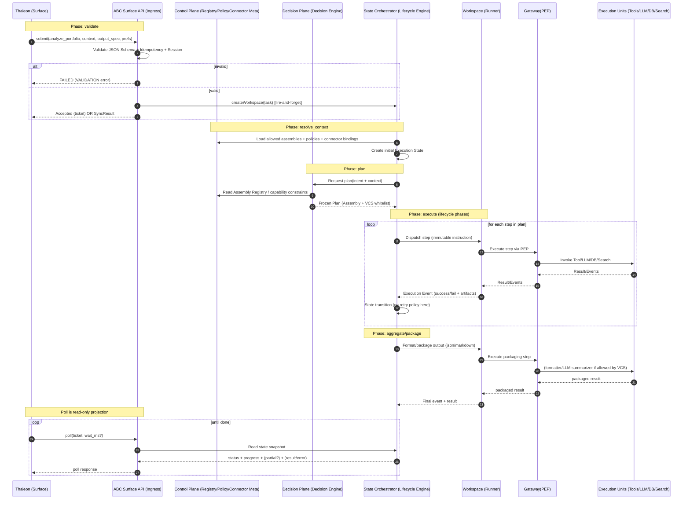

# IoC + 生命周期执行器

返回🔙

---

## **Executive Summary｜IoC + 生命周期执行器（Thaleon × ABC）**

**本页核心结论**

本页完整定义了一套**成熟、可长期演进的 IoC + 生命周期执行器架构**，用于规范 Thaleon 与 ABC 的分工边界与验收方式。

**Thaleon 负责声明“要什么”，ABC 负责决定“怎么跑”**；执行必须被严格约束在冻结的计划与能力白名单之内。

---

### **架构总览（一句话）**

> ABC 是 AI 的 Control Plane，其内部以 Maven 式 IoC + Lifecycle 模型运行；
> 

> Thaleon 只声明业务意图，绝不参与执行编排。
> 

---

### **四个 Plane 的清晰分工（Maven 对标）**

- **Interaction Surface（Thaleon）**
    
    发起请求、传递上下文、读取结果；一旦执行开始即“消失”。
    
- **Control Plane（ABC）**
    
    管理 Assembly、能力、Connector、策略与合规边界（“能用什么、怎么用才合法”）。
    
- **Decision Plane（ABC）**
    
    将 *意图 + 上下文* 编译成**冻结的执行计划（Assembly）与能力白名单（VCS）**。
    
- **State Orchestration Plane（ABC）**
    
    纯状态机推进生命周期；只推进、不做策略、不重试。
    
- **Execution Plane（ABC）**
    
    执行单一步骤（Tool / LLM / DB / Search），不决定流程、不越权。
    

> 任何把“编排/决策”塞进执行组件（如 LLM Gateway）的设计，都会破坏该架构。
> 

---

### **契约优先（IoC 的落地方式）**

- **Business Contract ≈ Maven POM**
    
    Thaleon 只输出：intent + context + output_spec + execution_preferences
    
    不包含：工具链、模型选择、流程细节。
    
- **Schema 即接口，时序即协议**
    
    submit / poll / result / error 均以 JSON Schema + 明确时序验收。
    

---

### **生命周期与可靠性**

- 执行遵循固定生命周期阶段（validate → plan → execute → package → done）。
- **幂等、可重放、可中断、可恢复** 是一等设计目标。
- poll 为**只读投影**，不得触发推进、重试或重新规划。

---

### **交付与验收标准（对 ABC）**

1. 严格按 Schema 回包（含进度与错误）。
2. poll 只读，不影响执行。
3. 内部分层实现：Decision → Orchestration → Execution。
4. 同输入同版本，产物结构稳定、语义不漂移。

---

### **本页的战略意义**

本页不是接口文档，而是**一份架构宪法级别的协作协议**：

- 确保 IoC 不被破坏
- 确保执行不失控
- 确保系统具备长期可演进性

**这是把 AI 系统做成“Kubernetes 级别 Control Plane”的必要前提。**

---

**ABC 的“四个面（Plane）”就像 Maven 的 IoC + 生命周期执行器**

（Thaleon）声明“要什么”，Maven（ABC）决定“怎么跑”，插件（Execution）只负责把活干完、把结果吐出来。

下面给你一个**一一对应的映射**（按“谁掌控流程”来对齐）。

---

## **ABC 四个 Plane ≈ Maven 的哪些部分**

### **0)（补充）Interaction Surface ≈  mvn … 命令入口**

- **Thaleon 发起请求**（analyze_portfolio + context）
    
    ≈
    
- **开发者敲 mvn package**（目标 + 少量参数）

> Surface 只负责“发起 + 传参”，不参与后续执行推进。
> 

---

### **1) Control Plane（控制面） ≈ POM/插件仓库/治理规则（“可用能力的目录与约束”）**

**ABC Control Plane** 管：

- Assembly/能力/工具的注册与版本
- Connector/凭证/合规模型（谁能用什么、怎么用）
- 策略与审计边界

**Maven 对应物**：

- 插件坐标与元数据（plugin repo、版本约束）
- settings.xml / 镜像/凭证（类似 connector）
- enforcer / company policy（类似治理与策略）

> 核心味道：**先把“能用什么、怎么用算合法”定义清楚**，执行时只按规则走。
> 

---

### **2) Decision Plane（决策面） ≈ Maven “生成执行计划”的那一层（Effective POM / 绑定目标到生命周期）**

**ABC Decision Plane** 做：

- 把“意图 + 上下文”变成**可执行的结构**（选用哪个 Assembly、哪些能力白名单、输出固定步骤/结构）

**Maven 对应物**：

- 解析 POM / profile / 依赖树，得到 **effective POM**
- 决定这个 packaging/goal 最终会跑哪些 plugin goal、参数是什么

> 这就是 IoC 的核心：**你声明目标，系统生成执行计划**；不是你手写“先跑 A 再跑 B”。
> 

---

### **3) State Orchestration Plane（编排/状态机面） ≈ Maven Lifecycle/Phase 执行器（只推进、不做策略）**

**ABC Orchestrator**：

- 只按“已冻结的结构”推进下一步
- 记录状态、接收事件、推进到下个状态

**Maven 对应物**：

- lifecycle engine：按 phase 顺序触发 mojo
- reactor build：维护构建状态、顺序与事件

> 类比最关键的一点：**它是“调度器/状态机”，不是“重新决策的大脑”**。
> 

---

### **4) Execution Plane（执行面） ≈ Maven 插件 Mojo（只干活，不决定流程）**

**ABC Execution Plane**：

- Workspace/Tool/LLM 调用/DB 查询/搜索等
- 只执行被指派的一步，把结果/事件回传

**Maven 对应物**：

- maven-compiler-plugin:compile / surefire:test …
- 插件做自己的工作，不应该“决定下一步跑什么”

> 这也是你们之前纠结的点：**把“编排”塞进执行组件（比如 LLM Gateway）就等于让插件决定生命周期，架构一定会变形。**
> 

---

## **用这个类比，怎么指导你们和 ABC 的分工（落到你刚说的三件事）**

1. **Business Contract ≈ POM 的声明层**
    
    Thaleon 输出：intent + context + options + expected output schema
    
    就像 POM 声明：目标、依赖、插件配置、产物形态。
    
2. **Flow-first / Sequence ≈ Lifecycle 时序图**
    
    你画的 Sequence Diagram 就像 Maven 的 phase/goal 顺序：
    
    - Thaleon 只定义“什么时候触发哪个 intent、拿什么上下文、期待什么回包/进度”
    - ABC 内部按 Plane 分工跑完（Decision 产计划，Orchestrator 推进，Execution 干活）
3. **验收标准 ≈ “给定 POM，mvn 必须产出符合预期的产物”**
    
    验收不是看 ABC 内部怎么写，而是看：
    
    - 是否按你给的时序返回（sync/async、ticket、progress）
    - 是否严格符合 JSON Schema（包括 error/progress）
    - 是否没有“插件越权”（执行组件不做编排、poll 不触发推进、网关不当大脑）

---

# 例子：analyze_portfolio 契约

如果你愿意，我可以把你们现在的 analyze_portfolio 契约，直接写成一份“POM 风格”的 **Contract 模板**（请求/响应/进度/错误），以及一张 **Maven 生命周期风格的时序图**，让 ABC 按这个去适配他们的四个 Plane。

---

下面给你一套**“POM 风格”的 analyze_portfolio Business Contract 模板**（请求/响应/进度/错误的 JSON Schema），以及一张**“Maven 生命周期风格”的时序图**（Mermaid Sequence Diagram）。

目标是：**Thaleon 只按契约发意图 + 上下文；ABC 内部自行映射到四个 Plane 去完成“计划→推进→执行→回包”**，对外只保证**Schema + 时序**。

---

# **1) Contract 元信息（POM 风格）**

把它当成 Maven 的 groupId/artifactId/version：

- **contractId**：com.thaleon.wm:analyze-portfolio:1.0.0
- **intent**：analyze_portfolio
- **compatibility**：向后兼容（新增字段只增不改；删除/改语义 = major bump）
- **I/O 形态**：submit（sync/async）+ poll（只读查询）

---

# **2) JSON Schema：Request（Submit）**

> 说明：请求支持两种输入方式：
> 

> A. 引用式
> 

> B. 内联式
> 

```
{
  "$schema": "https://json-schema.org/draft/2020-12/schema",
  "$id": "https://schemas.thaleon.com/contracts/analyze_portfolio/1.0.0/request.schema.json",
  "title": "AnalyzePortfolioRequest",
  "type": "object",
  "required": ["contract", "correlation", "intent", "context", "output_spec"],
  "additionalProperties": false,

  "properties": {
    "contract": {
      "type": "object",
      "required": ["contract_id", "version"],
      "additionalProperties": false,
      "properties": {
        "contract_id": { "const": "com.thaleon.wm:analyze-portfolio" },
        "version": { "const": "1.0.0" }
      }
    },

    "intent": { "const": "analyze_portfolio" },

    "correlation": {
      "description": "类似 Maven 构建的 build/session 标识：用于幂等、追踪、串联 poll。",
      "type": "object",
      "required": ["request_id", "idempotency_key", "session_id", "sent_at"],
      "additionalProperties": false,
      "properties": {
        "request_id": { "type": "string", "minLength": 8 },
        "idempotency_key": { "type": "string", "minLength": 8 },
        "session_id": { "type": "string", "minLength": 8 },
        "sent_at": { "type": "string", "format": "date-time" },
        "client_trace_id": { "type": "string" }
      }
    },

    "context": {
      "description": "业务上下文（Thaleon 定义）。ABC 不应要求 Thaleon 传工具链细节。",
      "type": "object",
      "required": ["as_of", "currency", "risk_profile"],
      "additionalProperties": false,
      "properties": {
        "as_of": { "type": "string", "format": "date" },
        "currency": { "type": "string", "minLength": 3, "maxLength": 3 },
        "locale": { "type": "string", "default": "zh-TW" },

        "risk_profile": {
          "type": "object",
          "required": ["risk_level"],
          "additionalProperties": false,
          "properties": {
            "risk_level": { "type": "string", "enum": ["conservative", "balanced", "growth", "aggressive"] },
            "max_drawdown_pct": { "type": "number", "minimum": 0, "maximum": 100 }
          }
        },

        "analysis_scope": {
          "type": "object",
          "additionalProperties": false,
          "properties": {
            "include_performance": { "type": "boolean", "default": true },
            "include_risk": { "type": "boolean", "default": true },
            "include_attribution": { "type": "boolean", "default": false },
            "include_recommendations": { "type": "boolean", "default": true }
          }
        },

        "benchmark": {
          "type": "object",
          "additionalProperties": false,
          "properties": {
            "benchmark_id": { "type": "string" },
            "benchmark_name": { "type": "string" }
          }
        },

        "constraints": {
          "type": "object",
          "additionalProperties": false,
          "properties": {
            "tax_consideration": { "type": "boolean", "default": false },
            "restricted_assets": {
              "type": "array",
              "items": { "type": "string" },
              "default": []
            }
          }
        }
      }
    },

    "input": {
      "description": "二选一：引用式 or 内联式。",
      "oneOf": [
        {
          "type": "object",
          "required": ["portfolio_ref"],
          "additionalProperties": false,
          "properties": {
            "portfolio_ref": {
              "type": "object",
              "required": ["portfolio_id"],
              "additionalProperties": false,
              "properties": {
                "portfolio_id": { "type": "string" },
                "account_id": { "type": "string" }
              }
            }
          }
        },
        {
          "type": "object",
          "required": ["positions"],
          "additionalProperties": false,
          "properties": {
            "positions": {
              "type": "array",
              "minItems": 1,
              "items": {
                "type": "object",
                "required": ["asset_id", "quantity", "asset_type"],
                "additionalProperties": false,
                "properties": {
                  "asset_id": { "type": "string" },
                  "asset_type": { "type": "string", "enum": ["equity", "bond", "fund", "etf", "cash", "crypto", "other"] },
                  "quantity": { "type": "number" },
                  "cost_basis": { "type": "number" },
                  "market_value": { "type": "number" },
                  "currency": { "type": "string", "minLength": 3, "maxLength": 3 }
                }
              }
            }
          }
        }
      ]
    },

    "output_spec": {
      "description": "类似 Maven packaging/format：决定最终产物形态，而不是内部怎么跑。",
      "type": "object",
      "required": ["format", "detail_level"],
      "additionalProperties": false,
      "properties": {
        "format": { "type": "string", "enum": ["json", "markdown"] },
        "detail_level": { "type": "string", "enum": ["summary", "standard", "detailed"] },
        "sections": {
          "type": "array",
          "items": { "type": "string", "enum": ["overview", "holdings", "risk", "performance", "attribution", "recommendations", "disclaimer"] },
          "default": ["overview", "holdings", "risk", "recommendations", "disclaimer"]
        }
      }
    },

    "execution_preferences": {
      "description": "只影响交互方式（sync/async/timeout），不应要求 Thaleon 提供编排细节。",
      "type": "object",
      "additionalProperties": false,
      "properties": {
        "mode": { "type": "string", "enum": ["auto", "sync", "async"], "default": "auto" },
        "max_latency_ms": { "type": "integer", "minimum": 50, "default": 1500 },
        "progress_granularity": { "type": "string", "enum": ["none", "phase", "step"], "default": "phase" },
        "poll_long_wait_ms": { "type": "integer", "minimum": 0, "maximum": 30000, "default": 0 }
      }
    }
  }
}
```

---

# **3) JSON Schema：Submit Response（Sync / Async 二选一）**

```
{
  "$schema": "https://json-schema.org/draft/2020-12/schema",
  "$id": "https://schemas.thaleon.com/contracts/analyze_portfolio/1.0.0/submit-response.schema.json",
  "title": "AnalyzePortfolioSubmitResponse",
  "oneOf": [
    { "$ref": "#/$defs/SyncResult" },
    { "$ref": "#/$defs/AsyncAccepted" }
  ],
  "$defs": {
    "SyncResult": {
      "type": "object",
      "required": ["kind", "contract", "correlation", "result"],
      "additionalProperties": false,
      "properties": {
        "kind": { "const": "result" },
        "contract": {
          "type": "object",
          "required": ["contract_id", "version"],
          "additionalProperties": false,
          "properties": {
            "contract_id": { "const": "com.thaleon.wm:analyze-portfolio" },
            "version": { "const": "1.0.0" }
          }
        },
        "correlation": {
          "type": "object",
          "required": ["request_id", "session_id"],
          "additionalProperties": false,
          "properties": {
            "request_id": { "type": "string" },
            "session_id": { "type": "string" }
          }
        },
        "result": { "$ref": "https://schemas.thaleon.com/contracts/analyze_portfolio/1.0.0/result.schema.json" },
        "warnings": { "type": "array", "items": { "type": "string" }, "default": [] }
      }
    },

    "AsyncAccepted": {
      "type": "object",
      "required": ["kind", "contract", "correlation", "task"],
      "additionalProperties": false,
      "properties": {
        "kind": { "const": "task" },
        "contract": {
          "type": "object",
          "required": ["contract_id", "version"],
          "additionalProperties": false,
          "properties": {
            "contract_id": { "const": "com.thaleon.wm:analyze-portfolio" },
            "version": { "const": "1.0.0" }
          }
        },
        "correlation": {
          "type": "object",
          "required": ["request_id", "session_id"],
          "additionalProperties": false,
          "properties": {
            "request_id": { "type": "string" },
            "session_id": { "type": "string" }
          }
        },
        "task": {
          "type": "object",
          "required": ["ticket", "status", "ttl_seconds"],
          "additionalProperties": false,
          "properties": {
            "ticket": { "type": "string" },
            "status": { "type": "string", "enum": ["QUEUED", "RUNNING"] },
            "ttl_seconds": { "type": "integer", "minimum": 1, "default": 3 },
            "poll_hint_ms": { "type": "integer", "minimum": 0, "default": 1500 }
          }
        }
      }
    }
  }
}
```

---

# **4) JSON Schema：Result（最终产物）**

```
{
  "$schema": "https://json-schema.org/draft/2020-12/schema",
  "$id": "https://schemas.thaleon.com/contracts/analyze_portfolio/1.0.0/result.schema.json",
  "title": "AnalyzePortfolioResult",
  "type": "object",
  "required": ["overview", "holdings", "risk", "recommendations", "disclaimer"],
  "additionalProperties": false,

  "properties": {
    "overview": {
      "type": "object",
      "required": ["portfolio_value", "currency", "highlights"],
      "additionalProperties": false,
      "properties": {
        "portfolio_value": { "type": "number" },
        "currency": { "type": "string", "minLength": 3, "maxLength": 3 },
        "highlights": { "type": "array", "items": { "type": "string" }, "minItems": 1 }
      }
    },

    "holdings": {
      "type": "object",
      "required": ["allocation", "top_positions"],
      "additionalProperties": false,
      "properties": {
        "allocation": {
          "type": "array",
          "items": {
            "type": "object",
            "required": ["dimension", "buckets"],
            "additionalProperties": false,
            "properties": {
              "dimension": { "type": "string", "enum": ["asset_class", "sector", "region", "currency"] },
              "buckets": {
                "type": "array",
                "items": {
                  "type": "object",
                  "required": ["name", "weight_pct"],
                  "additionalProperties": false,
                  "properties": {
                    "name": { "type": "string" },
                    "weight_pct": { "type": "number", "minimum": 0, "maximum": 100 }
                  }
                }
              }
            }
          }
        },
        "top_positions": {
          "type": "array",
          "items": {
            "type": "object",
            "required": ["asset_id", "name", "weight_pct"],
            "additionalProperties": false,
            "properties": {
              "asset_id": { "type": "string" },
              "name": { "type": "string" },
              "weight_pct": { "type": "number", "minimum": 0, "maximum": 100 }
            }
          }
        }
      }
    },

    "risk": {
      "type": "object",
      "required": ["risk_level", "metrics", "notes"],
      "additionalProperties": false,
      "properties": {
        "risk_level": { "type": "string", "enum": ["conservative", "balanced", "growth", "aggressive"] },
        "metrics": {
          "type": "object",
          "additionalProperties": false,
          "properties": {
            "volatility_annualized": { "type": "number" },
            "max_drawdown_pct": { "type": "number" },
            "var_95_pct": { "type": "number" },
            "beta": { "type": "number" }
          }
        },
        "notes": { "type": "array", "items": { "type": "string" }, "default": [] }
      }
    },

    "performance": {
      "type": "object",
      "additionalProperties": false,
      "properties": {
        "periods": {
          "type": "array",
          "items": {
            "type": "object",
            "required": ["range", "return_pct"],
            "additionalProperties": false,
            "properties": {
              "range": { "type": "string", "enum": ["1m", "3m", "6m", "1y", "3y", "5y", "ytd"] },
              "return_pct": { "type": "number" }
            }
          }
        }
      }
    },

    "recommendations": {
      "type": "array",
      "items": {
        "type": "object",
        "required": ["title", "rationale", "actions"],
        "additionalProperties": false,
        "properties": {
          "title": { "type": "string" },
          "rationale": { "type": "array", "items": { "type": "string" }, "minItems": 1 },
          "actions": {
            "type": "array",
            "items": {
              "type": "object",
              "required": ["type", "description"],
              "additionalProperties": false,
              "properties": {
                "type": { "type": "string", "enum": ["rebalance", "reduce_concentration", "hedge", "tax_optimize", "diversify", "hold"] },
                "description": { "type": "string" }
              }
            }
          }
        }
      }
    },

    "disclaimer": {
      "type": "object",
      "required": ["text"],
      "additionalProperties": false,
      "properties": {
        "text": { "type": "string" },
        "jurisdiction": { "type": "string" }
      }
    }
  }
}
```

---

# **5) JSON Schema：Poll（进度/结果/错误）**

> poll 是
> 
> 
> **只读**
> 

```
{
  "$schema": "https://json-schema.org/draft/2020-12/schema",
  "$id": "https://schemas.thaleon.com/contracts/analyze_portfolio/1.0.0/poll-response.schema.json",
  "title": "AnalyzePortfolioPollResponse",
  "type": "object",
  "required": ["contract", "ticket", "status", "ttl_seconds", "progress"],
  "additionalProperties": false,

  "properties": {
    "contract": {
      "type": "object",
      "required": ["contract_id", "version"],
      "additionalProperties": false,
      "properties": {
        "contract_id": { "const": "com.thaleon.wm:analyze-portfolio" },
        "version": { "const": "1.0.0" }
      }
    },

    "ticket": { "type": "string" },
    "next_ticket": { "type": "string" },

    "status": {
      "type": "string",
      "enum": ["QUEUED", "RUNNING", "SUCCEEDED", "FAILED", "CANCELED"]
    },

    "ttl_seconds": { "type": "integer", "minimum": 1 },

    "progress": {
      "type": "object",
      "required": ["phase", "percent"],
      "additionalProperties": false,
      "properties": {
        "phase": {
          "type": "string",
          "enum": ["validate", "resolve_context", "plan", "execute", "aggregate", "package", "done"]
        },
        "percent": { "type": "integer", "minimum": 0, "maximum": 100 },
        "current_step": { "type": "string" },
        "steps": {
          "type": "array",
          "items": {
            "type": "object",
            "required": ["step_id", "label", "status"],
            "additionalProperties": false,
            "properties": {
              "step_id": { "type": "string" },
              "label": { "type": "string" },
              "status": { "type": "string", "enum": ["PENDING", "RUNNING", "SUCCEEDED", "FAILED", "SKIPPED"] },
              "started_at": { "type": "string", "format": "date-time" },
              "ended_at": { "type": "string", "format": "date-time" },
              "message": { "type": "string" }
            }
          },
          "default": []
        }
      }
    },

    "partial_result": {
      "description": "可选：仅当 output_spec.detail_level=standard/detailed 且 ABC 支持阶段性产物时返回。",
      "type": "object",
      "additionalProperties": true
    },

    "result": {
      "description": "仅当 status=SUCCEEDED 时出现。",
      "$ref": "https://schemas.thaleon.com/contracts/analyze_portfolio/1.0.0/result.schema.json"
    },

    "error": {
      "description": "仅当 status=FAILED 时出现。",
      "$ref": "#/$defs/Error"
    }
  },

  "$defs": {
    "Error": {
      "type": "object",
      "required": ["code", "category", "message", "retryable"],
      "additionalProperties": false,
      "properties": {
        "code": { "type": "string" },
        "category": {
          "type": "string",
          "enum": ["VALIDATION", "AUTH", "DATA_SOURCE", "EXECUTION", "TIMEOUT", "COMPLIANCE", "INTERNAL"]
        },
        "message": { "type": "string" },
        "retryable": { "type": "boolean" },
        "retry_after_seconds": { "type": "integer", "minimum": 1 },
        "details": { "type": "object", "additionalProperties": true },
        "trace_id": { "type": "string" }
      }
    }
  }
}
```

---

# **6) Maven 生命周期风格：时序图（Sequence Diagram）**

> 把 analyze_portfolio 当成一次 Maven build：
> 

> Thaleon = 发起 mvn analyze-portfolio；ABC 内部 = 解析/计划/推进/执行；poll = 看构建日志/状态。
> 



---

# **7) 交付给 ABC 的“验收口径”（一句话版）**

ABC 只要做到：

1. submit / poll **严格按 Schema 回包**（含 error/progress）；
2. poll **只读**、不触发推进/重试/重新规划；
3. 内部按“plan(Decision) → advance(Orchestrator) → execute(Workspace)”分层实现；
4. **结果产物**必须稳定（同输入同版本，结构稳定；允许内容差异但字段与语义不漂）。

---

如果你要我更贴近你们现有数据域（比如 Thaleon 的 portfolio/position 字段命名、风险指标口径、合规免责声明模板），我可以把上面这套 Schema **换成你们的真实字段**并补一份“最小样例 JSON（request/async/sync/poll 成功/失败）”方便 ABC 直接对接测试。